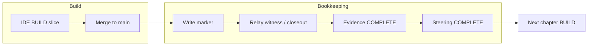
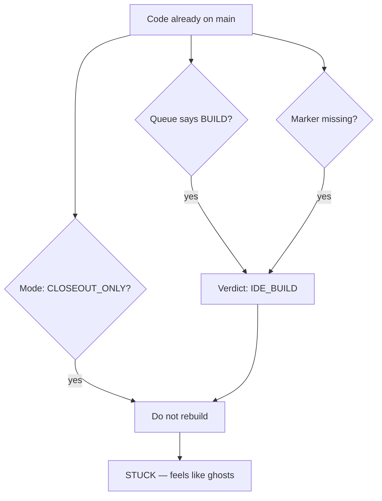

# Founder collaboration charter v1

**Plane:** CONTROL-PLANE · **Status:** Permanent charter — iterate in founder charter threads; do not treat as frozen.

**Audience:** Founder (systems owner) + all agents (operator, charter, IDE BUILD).

**Purpose:** Layered information, honest stalls, and decision defaults — rich context without git noise or hidden blockers.

**Related:** [`FOUNDER_OPERATOR_SURFACE_V1.md`](FOUNDER_OPERATOR_SURFACE_V1.md) · [`DELEGATION_ENVELOPE_V1.md`](DELEGATION_ENVELOPE_V1.md) · [`CHAPTER_COORDINATION_V1.md`](CHAPTER_COORDINATION_V1.md) · [`OPERATING_CALENDAR_V1.md`](OPERATING_CALENDAR_V1.md) · [`THREAD_STARTERS_V1.md`](THREAD_STARTERS_V1.md)

**Machine config:** [`FOUNDER_COLLABORATION_CHARTER_V1.json`](FOUNDER_COLLABORATION_CHARTER_V1.json) · **Pulse CLI:** `ppe_founder_pulse.cmd`

---

## Roles (plain language)

| Who | Owns | Does not own |
|-----|------|--------------|
| **Founder** | Product direction, SELECTION order, definition of done, external world (credentials, live testers, billing), canon conflicts when docs disagree | Git, relay scripts, marker repair, branch recovery, burst sizing |
| **Agents** | Factory execution, technical choices, bookkeeping repair, default next action from SOP | Silent stalls, implementation choice questions dressed as founder decisions |

**Founder strength:** systems thinking — milestones, spine order, what “done” means. Agents must **translate** factory state into ledger language (queue / marker / evidence / steering / sync), not raw verdict jargon.

---

## Factory posture (founder expectation)

> **Always be building** unless the founder is asleep or there is no documented product direction for what to build next.

| State | Agent behavior |
|-------|----------------|
| Normal | Advance relay, BUILD, or closeout — pick the safe default from SOP; do not idle waiting for permission |
| `SUPPLY_LOW` with steering candidate | Promote or charter next BUILD per [`ACTIVE_PRODUCT_DIRECTION.json`](ACTIVE_PRODUCT_DIRECTION.json) — do not stop |
| Missing direction SSOT | **Alert pulse** — ask founder once, in outcome language |
| Blocked with no active program | **Alert pulse immediately** — see § Layer 3 |
| Blocked but VM/worker/recovery actively running | **Completion pulse** when done — no alert spam |

---

## Layered pulses (do not collapse into one message)

Each layer has its own trigger and shape. **Never** let the weekly digest substitute for a same-day alert, or let “nothing required” hide Layer 3.

### Layer 1 — Morning (what happened yesterday)

| Field | Value |
|-------|--------|
| **When** | Once per local morning (default 08:00; env `PPE_NTFY_MORNING_REPORT_AT`) |
| **Channel** | ntfy (`scripts/ppe_morning_report.py`) + optional charter thread if founder opens morning chat |
| **Content** | Yesterday’s shipped slices/closeouts, current chapter in plain language, infra one-liner, “now” state |
| **Not** | Git commands, PR lists, burst plan, steward backlog dump |

**Charter opener:** see [`THREAD_STARTERS_V1.md`](THREAD_STARTERS_V1.md) § Founder collaboration.

**Generate locally:**

```bat
ppe_founder_pulse.cmd --layer morning
```

### Layer 2 — Completion (short pass after something finishes)

| Field | Value |
|-------|--------|
| **When** | After a slice closes, closeout PR merges, or chapter advances — not every agent turn |
| **Channel** | End of operator/agent reply in founder-visible threads; optional ntfy (`PPE_FOUNDER_COMPLETION_NTFY=1`) |
| **Content** | What finished, what it unlocks, next factory action (one line), founder role: Nothing / Listen |
| **Not** | Full OPERATOR_STATUS paste, recovery playbooks |

```bat
ppe_founder_pulse.cmd --layer completion --slice MSOS-VisParityV1-Closeout-Slice009
```

### Layer 3 — Alert (needs founder or true stall)

| Field | Value |
|-------|--------|
| **When** | **Immediately** when blocked and **no other program** is actively dealing with it |
| **Channel** | ntfy priority `high` + explicit **Alert:** line in replies — never buried in “nothing required” |
| **Content** | One-sentence problem in plain language, consequence, what agents tried, founder ask (if any) |
| **Not** | Technical fork questions (“repair vs recovery?”) |

**Fire alert when any:**

1. **Founder-only** — `human_only` delegation, external credentials, live validation you must run, canon conflict without SSOT
2. **Direction gap** — no documented next BUILD/SELECTION and queue empty (`SUPPLY_LOW` + steering gap)
3. **Deadlock** — contradictory factory state (e.g. `CLOSEOUT_ONLY` + product on main + missing marker + `IDE_BUILD`) **and** auto-repair failed or not running
4. **True stall** — no progress AND no active program: VM not in `BUILD_IN_FLIGHT` / `FINISH_IN_FLIGHT` / `RUN_LOCAL_PENDING`, burst workers = 0, no active worker lease, coordination verdict `recovery`/`park` with `blocks_build`

**Do not alert** when VM phase or operator thread is actively advancing (even if slow).

```bat
ppe_founder_pulse.cmd --layer alert --write
```

### Layer 4 — Weekly (systems rhythm)

| Field | Value |
|-------|--------|
| **When** | Monday (existing `weekly_digest_monday.cmd` pipeline) |
| **Channel** | ntfy + [`docs/RELEASES/WEEKLY_DIGEST.md`](../RELEASES/WEEKLY_DIGEST.md) |
| **Content** | Week throughput, milestone table honesty, steward backlog titles (`digest-only`), steering vs relay alignment gaps |
| **Not** | Daily noise, operator checklists |

**Founder time:** ~30 min optional review per [`OPERATING_CALENDAR_V1.md`](OPERATING_CALENDAR_V1.md).

```bat
ppe_founder_pulse.cmd --layer weekly
```

---

## Agent reply contract (founder-facing)

Use **one primary closing** from this table. Layer 3 overrides all others.

| Closing | Layer | When |
|---------|-------|------|
| **Nothing required from you.** | — | Factory advancing; no founder gap |
| **Completion:** _one sentence_ · Next: _one line_ · **Nothing required from you.** | L2 | Just finished slice/closeout/chapter step |
| **Alert:** _plain problem_ · _consequence_ · **Decision needed:** _outcome options_ OR **External action:** _one sentence_ | L3 | Stall, deadlock, or founder-only gap |
| **Decision needed:** _outcome language + default recommendation_ | L3 | Strategic judgment only — see § Decision defaults |

**Forbidden (all layers):**

- “Want me to…?” / “Should I…?” for **technical** choices
- Numbered git/relay steps assigned to founder
- “Nothing required” when Layer 3 conditions are true
- Pasting `OPERATOR_STATUS` or steward backlog as founder todos

**Bookkeeping translation (when blocked):** prefer “four ledgers disagree” / “desktop–VM sync lag” over raw verdict names. See § Bookkeeping for founders.

---

## Bookkeeping for founders (one page)

The factory tracks **code** and **records**. Code on `main` is not the same as “chapter done.” When you feel ghosts or contradiction, it is usually **records out of sync** — not missing product work.

### Four ledgers (must agree)

| Ledger | Plain name | What it says |
|--------|------------|--------------|
| **Queue** | What’s next in the factory | Active chapter + slice order (`PHASE_QUEUE`, manifest) |
| **Marker** | Product cleared for relay | “Do not rebuild — advance deterministically” (`IDE_PRODUCT_READY`) |
| **Evidence** | Honest witness truth | Closeout/witness rows in `*_EVIDENCE_STATUS.md` |
| **Steering** | Human-facing status | What we tell ourselves is COMPLETE (`MSOS_FRONTIER`, steering JSON) |

**Fifth thing:** product **code on `main`** — can land before the four ledgers catch up.

### Flow (healthy chapter)



### Deadlock (what it felt like this week)



**Translation for you:** “Product is built; paperwork and relay finish are behind.” Agents repair markers and run closeout — **not** a founder git decision.

### Sync (desktop + VM + GitHub)

Relay runs **one slice at a time** on the VM. Sync breaks when **two writers** touch queue/manifest/steering or desktop does not hand off after merge.

| Step | Who | Plain meaning |
|------|-----|----------------|
| BUILD | Desktop | Product slice implemented |
| Merge | GitHub | Code on `main` |
| Continue | Desktop → VM SSH | “VM, pull and finish” (`DESKTOP_CONTINUE`) |
| Relay | VM | Witness/closeout slices |
| Mirror | VM → GitHub | Phase/status back to repo (can lag) |

**Your overlap rule:** while a chapter is mid-closeout, avoid editing `main` + queue/manifest + that chapter’s `apps/msos-web` paths unless charter thread says otherwise.

**Agent canon:** [`CHAPTER_COORDINATION_V1.md`](CHAPTER_COORDINATION_V1.md)

---

## Ongoing integration (no permanent thread)

The collaboration **lives in the repo and pulses**, not in one long Cursor chat. Close this thread anytime.

### What carries the relationship day-to-day

| Channel | Layer | You do |
|---------|-------|--------|
| **ntfy morning** | L1 | Read ~30s — yesterday + now |
| **ntfy alert** | L3 | Read when fired — only stalls / founder gaps |
| **Monday digest** | L4 | Optional ~30 min systems skim |
| **Agent replies** | L2/L3 | Completion or Alert closing — no checklist |
| **Last pulse file** | any | `artifacts/control_plane/FOUNDER_PULSE_LAST.json` |

### When to open a **new** founder charter thread

Not daily. Open fresh when:

- Monthly charter tweak (15–30 min)
- After a frustrating day (“pulses lied” / “wrong decision asked”)
- Changing pulse rules, alert thresholds, or decision defaults

**Opener (copy-paste):**

```text
Founder collaboration thread. THREAD_ROLE: founder_charter.
Load @docs/SOP/FOUNDER_COLLABORATION_CHARTER_V1.md
Relay: off. Continue from charter + FOUNDER_PULSE_LAST.json — not prior chat history.
```

### What agents do without you in a charter thread

| Thread | Behavior |
|--------|----------|
| **Operator** | Execute factory; end with charter closings (L2/L3); run `ppe_founder_pulse.cmd --layer alert` when stall |
| **Charter / topic** | Your product/systems design; relay off |
| **IDE BUILD** | Ship slice; L2 completion when done |

**Posture:** always building unless asleep or missing direction SSOT — agents default technical choices ([§ Decision defaults](#decision-defaults)).

### Monthly ritual (calendar)

See [`OPERATING_CALENDAR_V1.md`](OPERATING_CALENDAR_V1.md) § Founder collaboration review — one short pass: did L1/L3/L4 feel honest? Edit charter if not.

---

Agents **default and execute** unless a row says **Ask founder**.

| Topic | Default | Ask founder when |
|-------|---------|-------------------|
| Scripts, branches, repair vs recovery, burst, markers | **Agent decides** | Never (unless `human_only`) |
| Queue promotion, evidence doc updates, closeout witness | **Agent decides** | Never |
| Pivot fields (`pivotId`, `northStar`, `primaryFocus`, `currentStage`) | — | **Always** ([`DELEGATION_ENVELOPE_V1.md`](DELEGATION_ENVELOPE_V1.md)) |
| SELECTION / build order when docs conflict | Recommend + execute aligned path | **Ask** — present max 2 **outcomes**, state default |
| SELECTION when no SSOT doc | — | **Ask** — charter gap |
| Definition of done / skip witness | Recommend honest evidence | **Ask** if skipping would misrepresent COMPLETE |
| External credentials, billing, live testers | — | **Always** — **External action:** |
| Canon conflict (vision vs repo) | Surface mismatch | **Ask** — pick update path |

**Reframe rule:** If the founder says “I don’t understand this decision,” the agent failed to frame it — reissue as outcome language with a recommended default.

---

## Thread model

| Thread | Opener | Relay | This charter |
|--------|--------|-------|--------------|
| **Founder collaboration** | `THREAD_ROLE: founder_charter` + this doc | **Off** | **Home** — update charter; **open fresh anytime** |
| **Operator** | `what's next?` | **On** | Closings + alert policy; no charter thread required |
| **Charter / topic** | `THREAD_ROLE: charter` | **Off** | One-line relay impact label |
| **IDE BUILD** | starter only | Slice only | Completion pulse when slice ships |

**You do not keep a collaboration thread open.** Pulses + this doc are the SSOT; new thread = same relationship.

---

## Regular review

| Cadence | Activity |
|---------|----------|
| **Weekly** | Founder skims Layer 4 digest; note one charter tweak if pulses misfired |
| **Monthly** | 15–30 min charter pass in collaboration thread — adjust thresholds, templates |
| **Ad hoc** | After a frustrating day — update “Alert triggers” or “Forbidden” rows |

Charter changes ship like any control-plane doc: gate → commit → PR. Version bumps in changelog below.

---

## Automation map

| Layer | Script | Artifact |
|-------|--------|----------|
| L1 Morning | `ppe_morning_report.py` (via watch / monday pipeline) | ntfy |
| L1–L4 text | `ppe_founder_pulse.py` | `artifacts/control_plane/FOUNDER_PULSE_LAST.json` |
| L4 Weekly | `weekly_digest_monday.cmd` | `docs/RELEASES/WEEKLY_DIGEST.md` |
| Stall detect | `ppe_founder_pulse.py --layer alert` | uses `COORDINATION_CHECK.json` + VM phase |

---

## Changelog

| Date | Change |
|------|--------|
| 2026-07-02 | v1 — layered pulses, alert-immediate stall policy, decision defaults, permanent charter thread |
| 2026-07-02 | Bookkeeping one-pager + ongoing integration (no permanent thread) |
