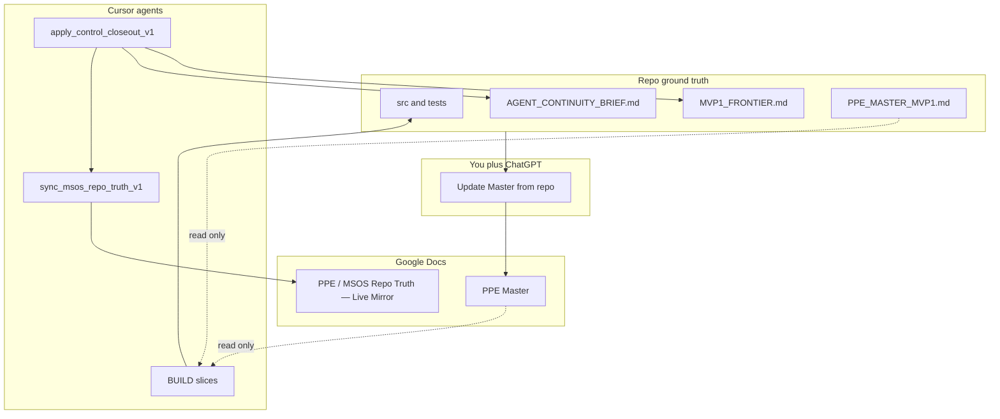

# Google Docs control plane v1

Purpose: define how **two Google Docs** work with the repo so Cursor, relay closeout, and ChatGPT stay aligned without role confusion.

Status: **v1** — MSOS auto-sync after control closeout; PPE Master is steward/ChatGPT only.

## Audience

| Role | Responsibility |
|------|----------------|
| **Cursor / relay** | Read PPE Master (optional MCP); **write PPE / MSOS Repo Truth — Live Mirror** only via `sync_msos_repo_truth_v1` |
| **ChatGPT / founder** | Update **PPE Master** from repo facts + product judgment; **never write MSOS** |
| **Operators** | OAuth once, doc markers once, optional Master import into repo |

## Operating model

```text
Repo (code + MVP1_FRONTIER + closeout)  = ground truth for "what exists"
        |
        +-- Cursor --> PPE / MSOS Repo Truth — Live Mirror (Google)   [auto block replace]
        |
        +-- You + ChatGPT --> PPE Master (Google)  [manual / periodic]
```



## Hard rules

| Actor | PPE Master (Google) | PPE / MSOS Repo Truth — Live Mirror (Google) | Repo `docs/` |
|--------|---------------------|---------------------------|--------------|
| Cursor / relay | **Never write** | **Replace auto block only** | Closeout writes `docs/SOP/*` via `apply_control_closeout_v1` |
| ChatGPT / you | **Write** (product/canon from repo) | **Do not write** | Import Master → `docs/VISION/PPE_MASTER_MVP1.md` when canon changes |
| Implementation disputes | Report to steward | N/A | **Pushed repo wins**; `MVP1_FRONTIER.md` wins slice queue |

Precedence (unchanged): pushed repo + accepted docs → `PPE_MASTER_MVP1` → `MVP1_FRONTIER` → `HANDOFF` → `OPERATING_RULES`.

## Reading order

### Cursor BUILD

1. [`AGENT_CONTINUITY_BRIEF.md`](AGENT_CONTINUITY_BRIEF.md) (generated)
2. [`MVP1_FRONTIER.md`](MVP1_FRONTIER.md) (live slice queue)
3. PPE Master — Google MCP **read-only** or [`PPE_MASTER_MVP1.md`](../VISION/PPE_MASTER_MVP1.md) for scope questions only

Do **not** use the **PPE / MSOS Repo Truth — Live Mirror** Google Doc as authority over repo; it is a human-facing mirror only.

### ChatGPT Master refresh

Use repo sources:

- [`MVP1_FRONTIER.md`](MVP1_FRONTIER.md)
- [`PPE_INTEGRATED_STATUS.md`](PPE_INTEGRATED_STATUS.md)
- [`HANDOFF.md`](HANDOFF.md)
- §15A in [`PPE_MASTER_MVP1.md`](../VISION/PPE_MASTER_MVP1.md)
- Spot checks under `src/` when contract rows change

MSOS is optional context for humans; **repo files are authoritative** for as-built facts.

## PPE / MSOS Repo Truth — Live Mirror (Google Doc) — one-time setup

In [PPE / MSOS Repo Truth — Live Mirror](https://docs.google.com/document/d/1BlGsdaKgBCPHwHqMR52io0-IDKLrSWvqhMXdrDxap1w/edit), add plain-text markers (visible in the doc):

```text
MSOS_REPO_TRUTH_AUTO_START
(cursor-maintained; do not edit between markers by hand)
MSOS_REPO_TRUTH_AUTO_END
```

Automation replaces everything **between** the markers (markers are found by text search; content is regenerated from repo).

**First read for ChatGPT:** open **§0 — INDEX** inside the auto block, then jump to the section ID for your question (§5 = right now, §7 = closed chapters, §12 = which repo file to open).

Env: `MSOS_REPO_TRUTH_DOC_ID` in `.env.mcp` (see [`MCP_GOOGLE_DOCS_SETUP.md`](MCP_GOOGLE_DOCS_SETUP.md)).

## When GOOGLE_DOCS_REFRESH runs (cycle hooks)

Canonical command: **refresh Google Docs**. Full protocol: [`GOOGLE_DOCS_REFRESH_V1.md`](GOOGLE_DOCS_REFRESH_V1.md).

| Trigger | When | Entry |
|---------|------|--------|
| **cycle-end** | After successful chapter closeout | [`post_relay_continue.py`](../../scripts/post_relay_continue.py) → `google_docs_refresh_v1` (`--trigger cycle-end`) |
| **cycle-start** | When `run_ppe.cmd` starts a phase (`manifest` → `RUNNING`) | [`ppe_run.py`](../../scripts/ppe_run.py) → `google_docs_refresh_v1` (`--trigger cycle-start`, best-effort WARN only) |
| **manual** | Operator or agent anytime | [`refresh_google_docs.cmd`](../../refresh_google_docs.cmd) |

Each refresh run:

1. Inspects repo git state and naming drift
2. Runs lightweight control-plane validation
3. Calls `sync_msos_repo_truth_v1` (Live Mirror push unless `--dry-run`)
4. Writes `artifacts/control_plane/google_docs_refresh_report.{json,md}`

**cycle-end** runs **after** `apply_control_closeout_v1` so steering docs and `continuity_brief.json` match the closed chapter before the mirror is regenerated.

MSOS push inside refresh is **best-effort** on **cycle-start** (phase still runs on WARN). On **cycle-end**, missing markers with credentials configured can exit non-zero for operator visibility (closeout patches already landed).

Manual run:

```powershell
python scripts/sync_msos_repo_truth.py --repo-root .
python scripts/sync_msos_repo_truth.py --repo-root . --dry-run
```

Artifacts (gitignored):

- `artifacts/msos_repo_truth_snapshot.md` — offline snapshot
- `artifacts/control_plane/msos_sync_report.json` — last sync result

## One-time setup before first live push

1. Complete MCP auth per [`MCP_GOOGLE_DOCS_SETUP.md`](MCP_GOOGLE_DOCS_SETUP.md).
2. Fill `.env.mcp` with `MSOS_REPO_TRUTH_DOC_ID` (and `PPE_MASTER_DOC_ID` for agent reads).
3. Install sync deps (local only): `pip install -e ".[google-docs-sync]"`
4. Add markers to the live-mirror Google Doc (see above).
5. Dry-run: `python scripts/sync_msos_repo_truth.py --repo-root . --dry-run`
6. Live push (first time or after API enable): `powershell -ExecutionPolicy Bypass -File scripts/ensure_google_docs_api_and_sync_msos.ps1` — opens Google Cloud **Enable Docs API** if needed, then pushes automatically.
7. Later pushes: `python scripts/sync_msos_repo_truth.py --repo-root .` (also runs after each relay closeout).

## When ChatGPT updates PPE Master

- Chapter close or contract change reflected in repo
- Periodic audit of §12 / §15A vs `src/`
- Strategic product decisions (not silent code drift)

After Master changes materially, steward may re-import into `docs/VISION/PPE_MASTER_MVP1.md` (separate pass; not automated here).

## Drift handling

If §15A in `PPE_MASTER_MVP1.md` and the generated MSOS §15A table disagree, `sync_msos_repo_truth_v1` records a warning in `msos_sync_report.json`. Cursor **does not** edit PPE Master. ChatGPT or steward resolves canon.

## Jobs

| Job | Registry | Writes Google? |
|-----|----------|----------------|
| `apply_control_closeout_v1` | §3.5 | No |
| `sync_msos_repo_truth_v1` | §3.6 | MSOS only (also invoked by refresh) |
| `google_docs_refresh_v1` | §3.7 | MSOS via sync; reports only otherwise |

See [`JOB_REGISTRY_V1.md`](JOB_REGISTRY_V1.md), [`RELAY_RUNTIME_V1.md`](RELAY_RUNTIME_V1.md), [`GOOGLE_DOCS_REFRESH_V1.md`](GOOGLE_DOCS_REFRESH_V1.md).

## Related

- MCP setup: [`MCP_GOOGLE_DOCS_SETUP.md`](MCP_GOOGLE_DOCS_SETUP.md)
- Agent guide: [`AGENT_GUIDE_ROLE.md`](AGENT_GUIDE_ROLE.md)
- Product canon: [`PPE_MASTER_MVP1.md`](../VISION/PPE_MASTER_MVP1.md) §15D

## Last updated

2026-05-25 — Initial Google Docs control plane v1 (MSOS sync + steward SOP).  
2026-05-25 — Renamed Google Doc display title to **PPE / MSOS Repo Truth — Live Mirror** (env `MSOS_REPO_TRUTH_DOC_ID` unchanged).  
2026-05-25 — Cycle hooks: `google_docs_refresh_v1` at phase start (`ppe_run`) and after closeout (`post_relay_continue`).
