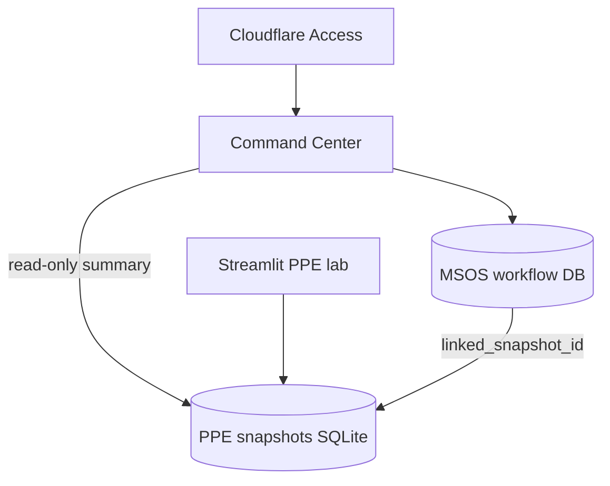

# MSOS live product sequence v1

**Purpose:** Canonical phased plan to make the **apex MSOS shell** a real product — not a fixture walkthrough. Agents and stewards use this when MSOS UI work touches Command Center data, auth, or persistence.

**As-of:** 2026-06-14 · **Controlling canon:** [`MSOS_WEBSITE_PROGRAM.md`](MSOS_WEBSITE_PROGRAM.md) · [`MSOS_P1_STACK_ROUTING_ADR.md`](MSOS_P1_STACK_ROUTING_ADR.md) · [`MSOS_Product_Semantics_State_Model_v0.1.md`](../VISION/MSOS/storyboard-v0.6/semantics/MSOS_Product_Semantics_State_Model_v0.1.md)

**Live queue:** [`MSOS_FRONTIER.md`](MSOS_FRONTIER.md) · [`PHASE_CHAPTER_BACKLOG.json`](PHASE_CHAPTER_BACKLOG.json)

---

## Long-term architecture (binding intent)

| Layer | Owns | Long-term home |
|-------|------|----------------|
| **MSOS** | Thesis lifecycle, expression plans, monitor/history narrative, Command Center “your work” | **Server-side workflow store**, user-scoped via Cloudflare Access |
| **PPE** | Distributions, disagreement, freeze/review **math** | **Streamlit +** `frozen_evaluation_store` (unchanged) |
| **Link** | “This thesis references snapshot X” | Reference IDs — **no PPE math in TypeScript** |

PPE frozen evaluations and MSOS theses are **related, not identical**. Command Center must not pretend snapshot rows are MSOS draft/confirmed theses without honest labeling.

---

## Phased queue (execute in order)

| Phase | chapterId | Priority | Outcome |
|-------|-----------|----------|---------|
| **1** | [`msos_production_wiring_v1`](SPRINT_MSOS_PRODUCTION_WIRING_V1.md) | HIGH | Sign-in, live embed, CTAs, wired nav — **fixtures OK** on Command Center |
| **2** | [`msos_user_state_v1`](SPRINT_MSOS_USER_STATE_V1.md) | HIGH | Command Center reads **real PPE snapshots** (read-only bridge) |
| **3** | [`msos_workflow_persistence_v1`](SPRINT_MSOS_WORKFLOW_PERSISTENCE_V1.md) | HIGH | MSOS theses/expressions **server-side**; replaces `localStorage` preview |
| **4** | `msos_access_identity_v1` | MEDIUM | Cloudflare Access on MSOS routes; user-scoped reads/writes |
| **5** | `msos_monitor_history_live_v1` | MEDIUM | Monitor + History from combined MSOS + PPE review state |

Phases 4–5 are **backlog stubs** until phase 3 closeout (charter at SELECTION).

---

## Phase 2 vs phase 3 (do not conflate)

| Question | Phase 2 (user state bridge) | Phase 3 (workflow persistence) |
|----------|----------------------------|--------------------------------|
| Data source | `ppe_frozen_evaluations.sqlite3` | New MSOS workflow tables |
| Command Center shows | Recent freezes, review due, honest KPIs from PPE | Draft/confirmed **thesis counts** from MSOS store |
| Multi-user | Single-operator OK; document gap | Requires phase 4 for production multi-user |
| UI copy | “From PPE snapshots” | “Your theses” when MSOS records exist |

---

## Data flow (target end state)

---

## Hard rules (all phases)

1. **No PPE math in TypeScript** — display/proxy/read only ([`REPO_LAYER_MAP_V1.md`](REPO_LAYER_MAP_V1.md)).
2. **Honest labels** — preview/fixture/snapshot-sourced copy when data is not MSOS-native.
3. **No custom auth server** — Cloudflare Access per stack ADR.
4. **No live execution** — sim-only expression until new SELECTION.

---

## Operator-visible milestones

| After phase | Operator can… |
|-------------|----------------|
| 1 | Sign in, open live PPE embed, use working nav/CTAs |
| 2 | See **real recent lab work** on Command Center (from snapshots) |
| 3 | Save/reopen theses server-side; KPIs reflect MSOS workflow |
| 4 | Multi-user-safe (each Access identity sees own rows) |
| 5 | Monitor/History reflect real lifecycle, not fixtures |

---

## Changelog

| Date | Change |
|------|--------|
| 2026-06-14 | v1 — phased sequence steward-approved; supersedes “fixture forever” implicit plan |
