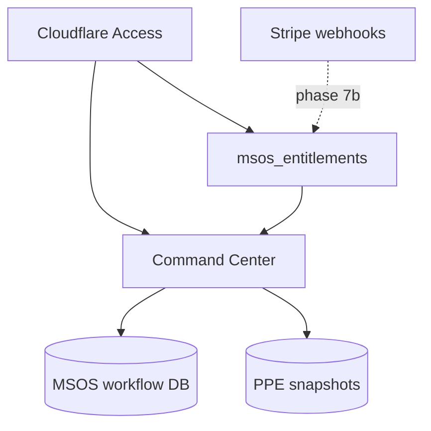

# MSOS live product sequence v1

**Purpose:** Canonical phased plan to make the **apex MSOS shell** a real, **customer-acquirable** product — not a fixture walkthrough. Agents and stewards use this when MSOS UI work touches Command Center data, auth, persistence, or commercial tiers.

**As-of:** 2026-06-14 · **Controlling canon:** [`MSOS_WEBSITE_PROGRAM.md`](MSOS_WEBSITE_PROGRAM.md) · [`MSOS_P1_STACK_ROUTING_ADR.md`](MSOS_P1_STACK_ROUTING_ADR.md) · [`MSOS_COMMERCIAL_ENTITLEMENTS_ADR.md`](MSOS_COMMERCIAL_ENTITLEMENTS_ADR.md)

**Live queue:** [`MSOS_FRONTIER.md`](MSOS_FRONTIER.md) · [`PHASE_CHAPTER_BACKLOG.json`](PHASE_CHAPTER_BACKLOG.json)

---

## Long-term architecture (binding intent)

| Layer | Owns | Long-term home |
|-------|------|----------------|
| **MSOS** | Thesis lifecycle, expression plans, monitor/history, entitlements | **Server-side workflow store**, user-scoped via Cloudflare Access |
| **PPE** | Distributions, disagreement, freeze/review **math** | **Streamlit +** `frozen_evaluation_store` (with `owner_email`) |
| **Commercial** | Free / research_beta / paid tiers | `msos_entitlements` → **Stripe** (phase 7b) |
| **Link** | “This thesis references snapshot X” | Reference IDs — **no PPE math in TypeScript** |

---

## Phased queue (execute in order)

| Phase | chapterId | Priority | Outcome |
|-------|-----------|----------|---------|
| **1** | [`msos_production_wiring_v1`](SPRINT_MSOS_PRODUCTION_WIRING_V1.md) | HIGH | Sign-in, live embed, CTAs, wired nav |
| **2** | [`msos_user_state_v1`](SPRINT_MSOS_USER_STATE_V1.md) | HIGH | Command Center from **PPE snapshots** (read-only) |
| **3** | [`msos_workflow_persistence_v1`](SPRINT_MSOS_WORKFLOW_PERSISTENCE_V1.md) | HIGH | MSOS theses/expressions **server-side** |
| **4a** | [`mvp1_snapshot_owner_v1`](SPRINT_MVP1_SNAPSHOT_OWNER_V1.md) | HIGH | `owner_email` on PPE freezes |
| **4b** | [`msos_access_identity_v1`](SPRINT_MSOS_ACCESS_IDENTITY_V1.md) | HIGH | Access on MSOS routes; scoped APIs |
| **5** | [`msos_monitor_history_live_v1`](SPRINT_MSOS_MONITOR_HISTORY_LIVE_V1.md) | HIGH | Monitor + History + CC strip live |
| **6** | [`msos_e2e_product_witness_v1`](SPRINT_MSOS_E2E_PRODUCT_WITNESS_V1.md) | MEDIUM | Full journey operator witness |
| **7a** | [`msos_entitlements_v1`](SPRINT_MSOS_ENTITLEMENTS_V1.md) | HIGH | **Free accounts** + manual paid path |
| **7b** | [`msos_billing_stripe_v1`](SPRINT_MSOS_BILLING_STRIPE_V1.md) | MEDIUM | **Stripe** self-serve pay — BUILD when operator ready |

**Operator note:** Phases 7a–7b may start BUILD after **4b** if commercial urgency; default queue order runs **6** first so the product loop is proven before monetization gates expand.

**Parallel UX (not a numbered phase):** [`msos_strategy_lab_embed_shell_v1`](SPRINT_MSOS_STRATEGY_LAB_EMBED_SHELL_V1.md) — MEDIUM priority; replaces box-in-box Streamlit iframe on `/strategy-lab` with storyboard `03_ppe_lab` chart shell. **Blocked until phase 3 COMPLETE**; does not block phases 4a–7.

---

## Product completeness bars

| Bar | Phases required |
|-----|-----------------|
| **Solo operator — works** | 1 → 2 → 3 |
| **Multi-user research beta** | + 4a → 4b → 5 |
| **Shippable demo / PMF test** | + 6 |
| **Acquire customers (free)** | + 7a |
| **Charge self-serve** | + 7b (Stripe) |

---

## Commercial path (summary)

See [`MSOS_COMMERCIAL_ENTITLEMENTS_ADR.md`](MSOS_COMMERCIAL_ENTITLEMENTS_ADR.md).

1. **Now (phase 7a):** Free tier on first Access login; operator grants `paid` manually; upgrade CTA → mailto/invoice link; log paid interest.
2. **Later (phase 7b):** Stripe Checkout + webhooks flip entitlements — **chartered, BUILD deferred** until operator configures Stripe.

---

## Data flow (target end state)

---

## Hard rules (all phases)

1. **No PPE math in TypeScript** — display/proxy/read only.
2. **Honest labels** — preview/fixture/snapshot-sourced when not MSOS-native.
3. **No custom auth server** — Cloudflare Access per stack ADR.
4. **No live execution** — sim-only expression until new SELECTION.
5. **No revenue claims** without [`VALIDATION_REALITY_CHECKS.md`](VALIDATION_REALITY_CHECKS.md) evidence.

---

## Operator-visible milestones

| After phase | Operator can… |
|-------------|----------------|
| 1 | Sign in, live PPE embed, working nav/CTAs |
| 2 | Command Center shows real PPE snapshot activity |
| 3 | Save/reopen theses server-side |
| 4a–4b | Each customer sees only their data |
| 5 | Full monitor/history loop live |
| 6 | Prove end-to-end journey on production URL |
| 7a | Onboard free users; manually upgrade paid |
| 7b | Customers pay via Stripe |

---

## Changelog

| Date | Change |
|------|--------|
| 2026-06-14 | v1 — initial phased sequence |
| 2026-06-14 | v2 — phases 4a–7b chartered (identity, monitor, E2E, entitlements, Stripe deferred) |
| 2026-06-18 | v3 — parallel UX chapter `msos_strategy_lab_embed_shell_v1` (MEDIUM, post–phase 3) |
