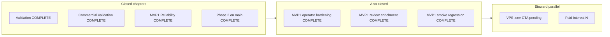

# PPE integrated status — canonical one-pager

**As-of:** 2026-05-19 · **Baseline `main`:** verify `git rev-parse origin/main` after push  
**Controlling canon:** [`docs/VISION/PPE_MASTER_MVP1.md`](../VISION/PPE_MASTER_MVP1.md) · **Live steering:** [`MVP1_FRONTIER.md`](MVP1_FRONTIER.md)

This file merges archived chapters, steward parallel work, engineering gates, and the doc map. On drift, **`MVP1_FRONTIER.md`** wins for slice queue; this file wins for cross-chapter summary.

---

## Flow (archived → steward → next BUILD)

---

## Archived chapters

| Chapter | Status | Sprint / evidence |
|---------|--------|-------------------|
| Validation | **COMPLETE** 2026-05-19 | [`SPRINT_VALIDATION_CHAPTER.md`](SPRINT_VALIDATION_CHAPTER.md), [`VALIDATION_EVIDENCE_STATUS.md`](VALIDATION_EVIDENCE_STATUS.md) |
| Commercial Validation | **COMPLETE** 2026-05-19 | [`SPRINT_POST_VALIDATION_COMMERCIAL.md`](SPRINT_POST_VALIDATION_COMMERCIAL.md), [`COMMERCIAL_VALIDATION_EVIDENCE_STATUS.md`](COMMERCIAL_VALIDATION_EVIDENCE_STATUS.md) |
| MVP1 Reliability | **COMPLETE** 2026-05-19 | [`SPRINT_MVP1_RELIABILITY.md`](SPRINT_MVP1_RELIABILITY.md), [`MVP1_RELIABILITY_EVIDENCE_STATUS.md`](MVP1_RELIABILITY_EVIDENCE_STATUS.md) |
| Phase 2 on `main` | **COMPLETE** 2026-05-19 | [`SPRINT_MVP1_PHASE2_ON_MAIN.md`](SPRINT_MVP1_PHASE2_ON_MAIN.md), [`MVP1_PHASE2_EVIDENCE_STATUS.md`](MVP1_PHASE2_EVIDENCE_STATUS.md) |
| MVP1 operator hardening | **COMPLETE** 2026-05-19 | [`SPRINT_MVP1_OPERATOR_HARDENING.md`](SPRINT_MVP1_OPERATOR_HARDENING.md), [`MVP1_OPERATOR_EVIDENCE_STATUS.md`](MVP1_OPERATOR_EVIDENCE_STATUS.md) |
| MVP1 memory & review enrichment | **COMPLETE** 2026-05-19 | [`SPRINT_MVP1_REVIEW_ENRICHMENT.md`](SPRINT_MVP1_REVIEW_ENRICHMENT.md), [`MVP1_REVIEW_ENRICHMENT_EVIDENCE_STATUS.md`](MVP1_REVIEW_ENRICHMENT_EVIDENCE_STATUS.md) |
| MVP1 smoke regression | **COMPLETE** 2026-05-19 | [`SPRINT_MVP1_SMOKE_REGRESSION.md`](SPRINT_MVP1_SMOKE_REGRESSION.md), [`MVP1_SMOKE_REGRESSION_EVIDENCE_STATUS.md`](MVP1_SMOKE_REGRESSION_EVIDENCE_STATUS.md) |

**Chapter close SELECTION:** [`POST_MVP1_REVIEW_ENRICHMENT_SELECTION_OUTCOME.md`](POST_MVP1_REVIEW_ENRICHMENT_SELECTION_OUTCOME.md) · **Next chapter SELECTION:** [`POST_MVP1_SMOKE_REGRESSION_SELECTION.md`](POST_MVP1_SMOKE_REGRESSION_SELECTION.md)

**Ops tail:** [`COMMERCIAL_OPS_COMPLETION.md`](COMMERCIAL_OPS_COMPLETION.md) — CTA + paid-interest remain steward.

---

## MVP1 smoke regression — final relay (archived)

| Status | Slice | Plane |
|--------|--------|-------|
| **CLOSED** | `MVP1-SmokeRegression-Control-Slice001` | CONTROL |
| **CLOSED** | `MVP1-SmokeRegression-Harness-Slice002` | PRODUCT |
| **CLOSED** | `MVP1-SmokeRegression-Witness-Slice003` | CONTROL |
| **CLOSED** | `MVP1-SmokeRegression-Closeout-Slice004` | CONTROL |

**Dual smoke:** `20260519_232908` + `233106` — **PASS** (~220s total).

**Next SELECTION:** [`POST_MVP1_SMOKE_REGRESSION_SELECTION.md`](POST_MVP1_SMOKE_REGRESSION_SELECTION.md)

---

## MVP1 review enrichment — final relay (archived)

| Status | Slice | Plane |
|--------|--------|-------|
| **CLOSED** | `MVP1-ReviewEnrichment-Control-Slice001` | CONTROL |
| **CLOSED** | `MVP1-ReviewEnrichment-Product-Slice002` | PRODUCT |
| **CLOSED** | `MVP1-ReviewEnrichment-Product-Slice003` | PRODUCT |
| **CLOSED** | `MVP1-ReviewEnrichment-Product-Slice004` | PRODUCT |
| **CLOSED** | `MVP1-ReviewEnrichment-Closeout-Slice005` | CONTROL |

**Next SELECTION:** [`POST_MVP1_REVIEW_ENRICHMENT_SELECTION.md`](POST_MVP1_REVIEW_ENRICHMENT_SELECTION.md)

---

## MVP1 operator hardening — final relay (archived)

All slices **CLOSED** 2026-05-19.

---

## Phase 2 on `main` — final relay (archived)

| Status | Slice | Plane |
|--------|--------|-------|
| **CLOSED** | `MVP1-Phase2-Control-Slice001` | CONTROL |
| **CLOSED** | `MVP1-Phase2-Reconcile-Slice002` | CONTROL |
| **CLOSED** | `MVP1-Phase2-Product-Slice003` | PRODUCT |
| **CLOSED** | `MVP1-Phase2-Closeout-Slice004` | CONTROL |
| **CLOSED** | `MVP1-Phase2-Product-Slice005` | PRODUCT |
| **CLOSED** | `MVP1-Phase2-Product-Slice006` — trust strip MVP1 disclosure | PRODUCT |
| **CLOSED** | `MVP1-Phase2-Chapter-Closeout-Slice007` | CONTROL |

**Reconcile:** [`PHASE2_RECONCILE_REPORT.md`](PHASE2_RECONCILE_REPORT.md) — directional strip **already_on_main**; no blind recovery merge.

---

## Engineering gates

| Gate | Status | Notes |
|------|--------|-------|
| `python -m pytest -q` | **PASS** | **168** passed (smoke regression 2026-05-19) |
| Dual smoke | **PASS** | `20260519_232908` + `20260519_233106` (~220s) |

Detail: [`MVP1_PHASE2_EVIDENCE_STATUS.md`](MVP1_PHASE2_EVIDENCE_STATUS.md)

---

## Steward parallel checklist

| Item | Status | Action |
|------|--------|--------|
| VPS repo-root `.env` → **Research beta (v0)** CTA | **pending** | Set `PPE_RESEARCH_OFFER_URL` / `PPE_RESEARCH_OFFER_LABEL` on VPS; `docker compose up -d --build`; mark **PASS** in [`VALIDATION_DEPLOY_WITNESS.md`](VALIDATION_DEPLOY_WITNESS.md) only after browser confirms CTA |
| Paid-interest live call | **N** (honest) | Log **Y/N** only after real conversation in [`VALIDATION_REALITY_CHECKS.md`](VALIDATION_REALITY_CHECKS.md) |

**Do not** mark CTA **PASS** or paid-interest **Y** without steward verification.

---

## Doc map

| Role | Path |
|------|------|
| **This one-pager** | [`PPE_INTEGRATED_STATUS.md`](PPE_INTEGRATED_STATUS.md) |
| Live frontier / slice queue | [`MVP1_FRONTIER.md`](MVP1_FRONTIER.md) |
| Session handoff gate | [`HANDOFF.md`](HANDOFF.md) |
| Post–Phase 2 SELECTION | [`POST_PHASE2_CHAPTER_SELECTION.md`](POST_PHASE2_CHAPTER_SELECTION.md) |
| Reconcile port/defer matrix | [`PHASE2_RECONCILE_REPORT.md`](PHASE2_RECONCILE_REPORT.md) |
| Phase 2 evidence clock | [`MVP1_PHASE2_EVIDENCE_STATUS.md`](MVP1_PHASE2_EVIDENCE_STATUS.md) |
| Deploy + CTA witness | [`VALIDATION_DEPLOY_WITNESS.md`](VALIDATION_DEPLOY_WITNESS.md) |
| Risk register | [`PPE_RISK_REGISTER.md`](PPE_RISK_REGISTER.md) |
| Commercial ops + smoke history | [`COMMERCIAL_OPS_COMPLETION.md`](COMMERCIAL_OPS_COMPLETION.md) |

---

## Deferred (reconcile — do not BUILD without SELECTION)

| Path / topic | Decision |
|--------------|----------|
| [`src/viz/mvp1_benchmark_substrate.py`](../../src/viz/mvp1_benchmark_substrate.py) | **defer** — recovery-only |
| Blind [`src/viz/app.py`](../../src/viz/app.py) merge | **defer** |
| [`tests/test_mvp1_benchmark_substrate.py`](../../tests/test_mvp1_benchmark_substrate.py) | **defer** |

---

## Next BUILD (agent lane)

**Await steward SELECTION** — [`POST_MVP1_SMOKE_REGRESSION_SELECTION.md`](POST_MVP1_SMOKE_REGRESSION_SELECTION.md). **Worry audit:** [`PPE_RISK_REGISTER.md`](PPE_RISK_REGISTER.md).
