# PPE integrated status — canonical one-pager

**As-of:** 2026-06-01 · **Baseline `main`:** verify `git rev-parse origin/main` after push  
**Controlling canon:** [`docs/VISION/PPE_MASTER_MVP1.md`](../VISION/PPE_MASTER_MVP1.md) · **MVP1 steering:** [`MVP1_FRONTIER.md`](MVP1_FRONTIER.md) · **MSOS steering:** [`MSOS_FRONTIER.md`](MSOS_FRONTIER.md)

This file merges archived chapters, steward parallel work, engineering gates, and the doc map. On drift, **`MVP1_FRONTIER.md`** wins for MVP1 slice queue; **`MSOS_FRONTIER.md`** wins for MSOS website slice queue; this file wins for cross-chapter summary.

---

## Active BUILD — none (await SELECTION)

| Field | Value |
|-------|--------|
| **Last closed** | MSOS P1 stack / routing ADR — **COMPLETE** 2026-06-01 |
| **ADR** | [`MSOS_P1_STACK_ROUTING_ADR.md`](MSOS_P1_STACK_ROUTING_ADR.md) |
| **Evidence** | [`MSOS_P1_STACK_ROUTING_EVIDENCE_STATUS.md`](MSOS_P1_STACK_ROUTING_EVIDENCE_STATUS.md) |
| **Next (blocked)** | MSOS P2 homepage — storyboard v0.6 not in-repo |

**P1 decision:** Phased hybrid — **`apps/msos-web/`** (Next.js 15 + TypeScript) for MSOS shell; **Streamlit** PPE unchanged; **Cloudflare Access** on `app.*`; PPE entry via **Caddy reverse proxy** at P4.

**MVP1 relay:** idle. **Operator:** drop storyboard, then SELECTION for P2 — [`MSOS_FRONTIER.md`](MSOS_FRONTIER.md).

---

## Flow (archived → steward → next BUILD)

```mermaid
flowchart LR
  subgraph closed [Closed chapters]
    V[Validation COMPLETE]
    C[Commercial Validation COMPLETE]
    R[MVP1 Reliability COMPLETE]
    P2[Phase 2 on main COMPLETE]
  end
  subgraph steward [Steward parallel]
    ENV[VPS .env CTA pending]
    PI[Paid interest N]
  end
  subgraph closed2 [Also closed]
    OH[MVP1 operator hardening COMPLETE]
    RE[MVP1 review enrichment COMPLETE]
    SR[MVP1 smoke regression COMPLETE]
  end
  closed --> closed2
  subgraph closed3 [Also closed]
    FF[MVP1 friends-first COMPLETE]
    BI[MVP1 belief-input COMPLETE]
    ON[MVP1 onboarding COMPLETE]
    P0[MSOS P0 COMPLETE]
  end
  closed2 --> closed3
  closed3 --> steward
  steward --> P1[MSOS P1 ADR in progress]
```

---

## Archived chapters (summary)

| Chapter | Status | Sprint / evidence |
|---------|--------|-------------------|
| Validation | **COMPLETE** 2026-05-19 | [`SPRINT_VALIDATION_CHAPTER.md`](SPRINT_VALIDATION_CHAPTER.md) |
| Commercial Validation | **COMPLETE** 2026-05-19 | [`SPRINT_POST_VALIDATION_COMMERCIAL.md`](SPRINT_POST_VALIDATION_COMMERCIAL.md) |
| MVP1 Reliability | **COMPLETE** 2026-05-19 | [`SPRINT_MVP1_RELIABILITY.md`](SPRINT_MVP1_RELIABILITY.md) |
| Phase 2 on `main` | **COMPLETE** 2026-05-19 | [`SPRINT_MVP1_PHASE2_ON_MAIN.md`](SPRINT_MVP1_PHASE2_ON_MAIN.md) |
| MVP1 operator hardening | **COMPLETE** 2026-05-19 | [`SPRINT_MVP1_OPERATOR_HARDENING.md`](SPRINT_MVP1_OPERATOR_HARDENING.md) |
| MVP1 review enrichment | **COMPLETE** 2026-05-19 | [`SPRINT_MVP1_REVIEW_ENRICHMENT.md`](SPRINT_MVP1_REVIEW_ENRICHMENT.md) |
| MVP1 smoke regression | **COMPLETE** 2026-05-19 | [`SPRINT_MVP1_SMOKE_REGRESSION.md`](SPRINT_MVP1_SMOKE_REGRESSION.md) |
| MVP1 friends-first screen | **COMPLETE** 2026-05-20 | [`SPRINT_MVP1_FRIENDS_FIRST_SCREEN.md`](SPRINT_MVP1_FRIENDS_FIRST_SCREEN.md) |
| MVP1 belief-input UX | **COMPLETE** 2026-05-20 | [`SPRINT_MVP1_BELIEF_INPUT_UX.md`](SPRINT_MVP1_BELIEF_INPUT_UX.md) |
| MVP1 onboarding / How it works | **COMPLETE** 2026-05-20 | [`SPRINT_MVP1_ONBOARDING_HOW_IT_WORKS.md`](SPRINT_MVP1_ONBOARDING_HOW_IT_WORKS.md) |
| MVP1 disagreement strip polish | **COMPLETE** 2026-05-26 | [`SPRINT_MVP1_DISAGREEMENT_CANDIDATE_STRIP_POLISH.md`](SPRINT_MVP1_DISAGREEMENT_CANDIDATE_STRIP_POLISH.md) |
| Phase 3 commercial wrapper | **COMPLETE** 2026-05-28 | [`SPRINT_PHASE3_COMMERCIAL_WRAPPER.md`](SPRINT_PHASE3_COMMERCIAL_WRAPPER.md) |
| MVP1 Phase 6 trust metrics v1 | **COMPLETE** 2026-06-01 | [`SPRINT_MVP1_PHASE6_TRUST_METRICS_V1.md`](SPRINT_MVP1_PHASE6_TRUST_METRICS_V1.md) |
| MSOS Website Program P0 | **COMPLETE** 2026-06-01 | [`SPRINT_MSOS_WEBSITE_PROGRAM_P0.md`](SPRINT_MSOS_WEBSITE_PROGRAM_P0.md), [`MSOS_WEBSITE_PROGRAM_P0_EVIDENCE_STATUS.md`](MSOS_WEBSITE_PROGRAM_P0_EVIDENCE_STATUS.md) |
| MSOS P1 stack routing ADR | **COMPLETE** 2026-06-01 | [`SPRINT_MSOS_P1_STACK_ROUTING.md`](SPRINT_MSOS_P1_STACK_ROUTING.md), [`MSOS_P1_STACK_ROUTING_EVIDENCE_STATUS.md`](MSOS_P1_STACK_ROUTING_EVIDENCE_STATUS.md) |

**Ops tail:** [`COMMERCIAL_OPS_COMPLETION.md`](COMMERCIAL_OPS_COMPLETION.md) — VPS CTA + paid-interest remain steward.

---

## Engineering gates

| Gate | Status | Notes |
|------|--------|-------|
| `python -m pytest -q` | verify on branch | Run before P1 closeout push |
| Dual smoke | last PASS on MVP1 chapters | MSOS P1 is docs-only |

---

## Steward parallel checklist

| Item | Status | Action |
|------|--------|--------|
| **Active relay chapter** | **none** | MSOS P1 **COMPLETE**; manifest `COMPLETE` |
| VPS repo-root `.env` → **Research beta (v0)** CTA | **pending** | [`COMMERCIAL_OPS_COMPLETION.md`](COMMERCIAL_OPS_COMPLETION.md) |
| Paid-interest live call | **N** (honest) | [`VALIDATION_REALITY_CHECKS.md`](VALIDATION_REALITY_CHECKS.md) |
| **Storyboard v0.6** | **not in-repo** | Blocks MSOS P2 — operator drops files per [`MSOS_STORYBOARD_GATE.md`](../VISION/MSOS_STORYBOARD_GATE.md) |

**After `run_ppe.cmd`:** read `artifacts/orchestrator/LAST_RUN_REPORT.md`; **new Cursor thread** with [`AGENT_CONTINUITY_BRIEF.md`](AGENT_CONTINUITY_BRIEF.md) only.

---

## Doc map

| Role | Path |
|------|------|
| **This one-pager** | [`PPE_INTEGRATED_STATUS.md`](PPE_INTEGRATED_STATUS.md) |
| MVP1 frontier | [`MVP1_FRONTIER.md`](MVP1_FRONTIER.md) |
| MSOS frontier | [`MSOS_FRONTIER.md`](MSOS_FRONTIER.md) |
| MSOS P1 ADR | [`MSOS_P1_STACK_ROUTING_ADR.md`](MSOS_P1_STACK_ROUTING_ADR.md) |
| Session handoff | [`HANDOFF.md`](HANDOFF.md) |
| Deploy + CTA witness | [`VALIDATION_DEPLOY_WITNESS.md`](VALIDATION_DEPLOY_WITNESS.md) |

---

## Deferred (reconcile — do not BUILD without SELECTION)

| Path / topic | Decision |
|--------------|----------|
| [`src/viz/mvp1_benchmark_substrate.py`](../../src/viz/mvp1_benchmark_substrate.py) | **defer** — recovery-only |
| Blind [`src/viz/app.py`](../../src/viz/app.py) merge | **defer** |

---

## Next BUILD (agent lane)

**Await steward SELECTION** — [`MSOS_FRONTIER.md`](docs/SOP/MSOS_FRONTIER.md). **Worry audit:** [`PPE_RISK_REGISTER.md`](PPE_RISK_REGISTER.md).
