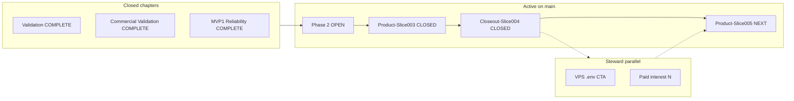

# PPE integrated status — canonical one-pager

**As-of:** 2026-05-19 · **Baseline `main`:** `566f4f0` ([`origin/main`](https://github.com/DanielTabakman/Probability-prediction-engine))  
**Controlling canon:** [`docs/VISION/PPE_MASTER_MVP1.md`](../VISION/PPE_MASTER_MVP1.md) · **Live steering:** [`MVP1_FRONTIER.md`](MVP1_FRONTIER.md)

This file merges archived chapters, active Phase 2 relay state, engineering gates, steward parallel work, and the doc map. On drift, **`MVP1_FRONTIER.md`** wins for slice queue; this file wins for cross-chapter summary.

---

## Flow (closed → active → steward → next BUILD)



---

## Archived chapters

| Chapter | Status | Sprint / evidence |
|---------|--------|-------------------|
| Validation | **COMPLETE** 2026-05-19 | [`SPRINT_VALIDATION_CHAPTER.md`](SPRINT_VALIDATION_CHAPTER.md), [`VALIDATION_EVIDENCE_STATUS.md`](VALIDATION_EVIDENCE_STATUS.md) |
| Commercial Validation | **COMPLETE** 2026-05-19 | [`SPRINT_POST_VALIDATION_COMMERCIAL.md`](SPRINT_POST_VALIDATION_COMMERCIAL.md), [`COMMERCIAL_VALIDATION_EVIDENCE_STATUS.md`](COMMERCIAL_VALIDATION_EVIDENCE_STATUS.md) |
| MVP1 Reliability | **COMPLETE** 2026-05-19 | [`SPRINT_MVP1_RELIABILITY.md`](SPRINT_MVP1_RELIABILITY.md), [`MVP1_RELIABILITY_EVIDENCE_STATUS.md`](MVP1_RELIABILITY_EVIDENCE_STATUS.md) |

**Ops tail:** [`COMMERCIAL_OPS_COMPLETION.md`](COMMERCIAL_OPS_COMPLETION.md) — agent lane done; CTA + paid-interest remain steward.

---

## Active — Phase 2 on `main`

**Sprint:** [`SPRINT_MVP1_PHASE2_ON_MAIN.md`](SPRINT_MVP1_PHASE2_ON_MAIN.md) · **Plan:** [`PHASE_PLANS/mvp1_phase2_on_main_relay.json`](PHASE_PLANS/mvp1_phase2_on_main_relay.json) · **SELECTION (chapter):** [`POST_MVP1_RELIABILITY_SELECTION_OUTCOME.md`](POST_MVP1_RELIABILITY_SELECTION_OUTCOME.md) · **SELECTION (post–Slice003):** [`POST_PHASE2_PRODUCT_SLICE003_SELECTION.md`](POST_PHASE2_PRODUCT_SLICE003_SELECTION.md)

| Status | Slice | Plane |
|--------|--------|-------|
| **CLOSED** | `MVP1-Phase2-Control-Slice001` | CONTROL |
| **CLOSED** | `MVP1-Phase2-Reconcile-Slice002` | CONTROL |
| **CLOSED** | `MVP1-Phase2-Product-Slice003` — MVP1 UI exclusions (copy + harness) | PRODUCT |
| **CLOSED** | `MVP1-Phase2-Closeout-Slice004` — checkpoint | CONTROL |
| **NEXT** | `MVP1-Phase2-Product-Slice005` — decision surface / panel parity audit | PRODUCT |

**Reconcile:** [`PHASE2_RECONCILE_REPORT.md`](PHASE2_RECONCILE_REPORT.md) — Sprint004 directional strip **already_on_main**; no blind recovery merge.

**Next slice spec:** [`SPRINT_MVP1_PHASE2_SLICE005.md`](SPRINT_MVP1_PHASE2_SLICE005.md)

---

## Engineering gates

| Gate | Status | Notes |
|------|--------|-------|
| `python -m pytest -q` | **PASS** | **157** passed (product @ `01c89cf`; docs @ `566f4f0`) |
| Dual smoke (post–Slice003) | **PASS** | `20260519_144000` + `20260519_144350` |

Detail: [`MVP1_PHASE2_EVIDENCE_STATUS.md`](MVP1_PHASE2_EVIDENCE_STATUS.md)

---

## Steward parallel checklist

| Item | Status | Action |
|------|--------|--------|
| VPS repo-root `.env` → **Research beta (v0)** CTA | **pending** | Set `PPE_RESEARCH_OFFER_URL` / `PPE_RESEARCH_OFFER_LABEL` on VPS; `docker compose up -d --build`; mark **PASS** in [`VALIDATION_DEPLOY_WITNESS.md`](VALIDATION_DEPLOY_WITNESS.md) after browser confirms CTA |
| Paid-interest live call | **N** (honest) | Use script in [`COMMERCIAL_OPS_COMPLETION.md`](COMMERCIAL_OPS_COMPLETION.md) §Outreach; log **Y/N** only after real conversation in [`VALIDATION_REALITY_CHECKS.md`](VALIDATION_REALITY_CHECKS.md) |

**VPS steps (summary):**

```bash
cd /opt/marketstructureos
git pull
# .env (not committed): PPE_RESEARCH_OFFER_URL=mailto:...  PPE_RESEARCH_OFFER_LABEL=Request research beta access
docker compose up -d --build
git rev-parse HEAD   # expect main @ 566f4f0+ after agent push
```

**Do not** mark paid-interest **Y** without a live call.

---

## Doc map

| Role | Path |
|------|------|
| **This one-pager** | [`PPE_INTEGRATED_STATUS.md`](PPE_INTEGRATED_STATUS.md) |
| Live frontier / slice queue | [`MVP1_FRONTIER.md`](MVP1_FRONTIER.md) |
| Session handoff gate | [`HANDOFF.md`](HANDOFF.md) |
| Reconcile port/defer matrix | [`PHASE2_RECONCILE_REPORT.md`](PHASE2_RECONCILE_REPORT.md) |
| Phase 2 evidence clock | [`MVP1_PHASE2_EVIDENCE_STATUS.md`](MVP1_PHASE2_EVIDENCE_STATUS.md) |
| Deploy + CTA witness | [`VALIDATION_DEPLOY_WITNESS.md`](VALIDATION_DEPLOY_WITNESS.md) |
| Commercial ops + smoke history | [`COMMERCIAL_OPS_COMPLETION.md`](COMMERCIAL_OPS_COMPLETION.md) |

---

## Deferred (reconcile — do not BUILD without SELECTION)

| Path / topic | Decision |
|--------------|----------|
| [`src/viz/mvp1_benchmark_substrate.py`](../../src/viz/mvp1_benchmark_substrate.py) | **defer** — recovery-only; `main` uses [`mvp1_decision_surface.py`](../../src/viz/mvp1_decision_surface.py) |
| Blind [`src/viz/app.py`](../../src/viz/app.py) merge | **defer** |
| [`implied_lab_provenance.py`](../../src/viz/implied_lab_provenance.py) substrate wiring | **defer** until parity audit completes |
| [`tests/test_mvp1_benchmark_substrate.py`](../../tests/test_mvp1_benchmark_substrate.py) | **defer** |

---

## Next BUILD (agent lane)

**Chartered:** `MVP1-Phase2-Product-Slice005` — bounded parity audit of MVP1 decision surface vs verification panel copy/labels on `main` (see [`SPRINT_MVP1_PHASE2_SLICE005.md`](SPRINT_MVP1_PHASE2_SLICE005.md)). **Not** a full substrate module port.
