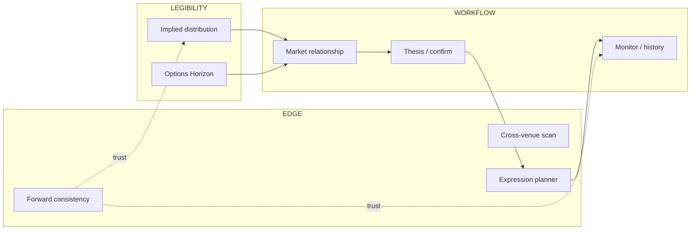

# PPE module registry v1

**Purpose:** Single map of **analytical modules** inside MSOS — what each tool is for, how far it is chartered to go, where data comes from, and how it advances through relay.

**Status:** Living draft — improve as we go.

**Visual map:** [`assets/msos_module_map.html`](assets/msos_module_map.html) (open in browser — top panels auto-sync via `ppe_operator_compass.py`)

**As-of:** 2026-06-30

**Controlling context:** [`MSOS_PRODUCT_BACKPLANE_CHARTER_V1.md`](MSOS_PRODUCT_BACKPLANE_CHARTER_V1.md) · [`MSOS_UX_DESIGN_PHILOSOPHY_V1.md`](MSOS_UX_DESIGN_PHILOSOPHY_V1.md) · [`REPO_LAYER_MAP_V1.md`](REPO_LAYER_MAP_V1.md) · [`BUILD_PACKET_TEMPLATE.md`](BUILD_PACKET_TEMPLATE.md)

---

## MSOS north-star pillars

Everything we build should serve at least one pillar. Most modules serve one primary pillar; workflow glue may serve two.

| Pillar | What it means | Examples |
|--------|---------------|----------|
| **WORKFLOW** | Trader uses MSOS as part of their process — thesis, relate to market, express, return, review | Strategy Lab loop, confirm, monitor, history |
| **EDGE** | Find and **test** executable dislocations and structure fit — simulation and research only, not order routing | Forward consistency, cross-venue gap scan, expression planner |
| **LEGIBILITY** | Make priced market structure **honest and readable** — what is implied, what is thin, what is comparable | Implied distribution, Options Horizon, trust labels, consistency flags |

**Market relationship** is part of WORKFLOW: how the user relates their view to the market. **Disagreement** (belief vs implied distribution) is the **primary relationship mode today** for the distribution module; additional relationship modes are planned — do not treat disagreement as the only forever grammar.

---

## Vocabulary

| Term | Meaning |
|------|---------|
| **Platform** | MSOS — shell, workflow, identity, navigation |
| **Analytical module** | Bounded PPE capability: one primary market question, Python math, display contract |
| **Workflow surface** | MSOS-owned lifecycle (thesis, confirm, expression save, monitor) — not a PPE math module |
| **Module program** | Charter + relay chapter sequence for one analytical module |
| **Display boundary** | Read-only JSON from `src/viz/` — MSOS fetches, never recomputes |
| **Integration tier** | How far a module is **chartered** to ship (T0–T4) — set at SELECTION, updated at closeout |
| **Archive charter** | Required at T3+: **why** we collect, **what** subset, **how often**, **who consumes it** |

Storyboard **Lens** ≈ analytical module in product language.

---

## Module class (extensible)

**Module class** = the primary market question. Add new classes only via steward SELECTION + registry row.

| Class ID | Primary question | Modules |
|----------|------------------|---------|
| `DISTRIBUTION` | What outcome distribution do options **price** at this expiry? | `implied_distribution` |
| `PROJECTION` | How does options-implied structure look in **price × time**? | `options_horizon` |
| `CONSISTENCY` | Do **related executable markets agree** after spreads and costs? | `forward_consistency` |
| `EXPOSURE` | What **structure fits** a view under constraints (simulation)? | `expression_planner` |
| `EXPOSURE_PATH` | What **ways exist** to get exposure to an asset (multi-rail menu)? | `exposure_menu` |
| `EVENT_GAP` | How do **event markets** compare to options-implied probabilities? | `cross_venue_event_gap` |
| `POSITIONING` | Where is leverage / positioning concentrated? | *(planned)* |
| `REPLAY` | How did implied structure **evolve** over time? | *(horizon replay — planned)* |
| *reserved* | Steward adds row | — |

---

## Integration tier (charter at SELECTION)

Every module declares **target tier** and **current tier** when chartered. Relay slices advance tier; closeout updates registry.

| Tier | Delivers | Charter question |
|------|----------|------------------|
| **T0 — Contract** | Python types, semantic copy, fixture JSON, unit tests | “What is the output shape?” |
| **T1 — Boundary** | `GET /ppe-display-api/...` + pytest boundary tests | “Can MSOS fetch honest JSON?” |
| **T2 — MSOS surface** | Route + read-only UI (display/proxy only) | “Can a human inspect it in MSOS?” — must meet [`MSOS_UX_DESIGN_PHILOSOPHY_V1.md`](MSOS_UX_DESIGN_PHILOSOPHY_V1.md) bar |
| **T3 — Archive** | Scheduled snapshot → `artifacts/` + optional history API | “**Why** collect? **What** subset? **How often**?” |
| **T4 — Workflow hook** | Deep-links, Monitor feed, Command Center cards | “Does it close the trader loop?” |

A module may **stop** at any tier by design (e.g. forward consistency: T2 internal radar first, T3 only after archive charter is written).

**Chartering rule:** `target_tier` must be explicit in SELECTION. Do not default to T3 “because we might need history someday.”

---

## T3 archive charter (required before collector slices)

Not every market event should be archived. Before any `collect_*` slice ships, the program doc must fill:

| Field | Question |
|-------|----------|
| **Hypothesis** | What decision or trust question does this history answer? |
| **Consumer** | Trader, operator, research backtest, or witness only? |
| **Granularity** | Per asset? per expiry? daily only? state-change only? |
| **Retention** | How long kept; max disk; rollup rules |
| **Trigger** | Schedule (VM daily), on-demand, or event-driven diff only |
| **Non-goals** | What we explicitly **do not** store |

**Anti-pattern:** “Collect everything from every venue forever.” Reject unless steward SELECTION with cost model.

**Example (forward consistency, proposed):** Daily snapshot of **enabled assets × listed expiries × status + flags + net edge** — not full order books; hypothesis = “did WATCH persist or was it stale quotes?”

---

## MSOS pillar + first ship-to

Two axes — avoids overloading one “lane” label.

### Primary MSOS pillar

| Pillar | Module examples |
|--------|-----------------|
| **WORKFLOW** | Workflow surfaces; expression planner (process fit); exposure menu (front door) |
| **EDGE** | Forward consistency, cross-venue scan, expression fit math |
| **LEGIBILITY** | Implied distribution, Options Horizon, trust surface |
| **INFRA** | Catalog, cache health, multi-asset witnesses *(meta, not analytical modules)* |

### First ship-to (who sees v1 first)

| Ship-to | Meaning |
|---------|---------|
| **TRADER** | Primary nav / Strategy Lab / Horizon — self-serve |
| **OPERATOR** | Internal route, artifacts, VM ops — trust and witnesses |
| **RESEARCH** | Side-channel quant, backtest inputs, non-blocking relay |

Modules can move ship-to later (e.g. consistency: OPERATOR → TRADER Monitor hook at T4).

---

**Resolve any module or chapter:**

```bash
python scripts/resolve_sop.py --module <module_id> --json
python scripts/resolve_sop.py --chapter <chapter_id> --json
```

Index: [`CHAPTER_DOC_INDEX.json`](CHAPTER_DOC_INDEX.json) · rule: [`.cursor/rules/sop-discovery.mdc`](../../.cursor/rules/sop-discovery.mdc)

---

## Registered modules (living table)

Update at every module SELECTION / closeout. **Advance?** = steward yes/no for next tier or chapter.

| # | Module ID | Display name | Class | Pillar | Ship-to | Route / artifact | Boundary API | Program doc | Tier (cur→tgt) | Priority | Status | Advance? |
|---|-----------|--------------|-------|--------|---------|------------------|--------------|-------------|----------------|----------|--------|----------|
| 1 | `implied_distribution` | Implied distribution | DISTRIBUTION | LEGIBILITY | TRADER | `/strategy-lab` | `/ppe-display-api/display.json` | [`MVP1_FRONTIER.md`](MVP1_FRONTIER.md) | T2→T4 | P0 | **LIVE** | T4: richer relationship modes |
| 2 | `options_horizon` | Options Horizon | PROJECTION | LEGIBILITY | TRADER | `/options-horizon` | `/ppe-display-api/horizon/*.json` | [`OPTIONS_HORIZON_PROGRAM_V1.md`](OPTIONS_HORIZON_PROGRAM_V1.md) | T2→T5* | P1 | **LIVE** | chart polish + archive |
| 3 | `forward_consistency` | Forward consistency | CONSISTENCY | EDGE + LEGIBILITY | OPERATOR | `/forward-consistency` (planned) | `/ppe-display-api/forward-consistency.json` | [`FORWARD_CONSISTENCY_RADAR_PROGRAM_V1.md`](FORWARD_CONSISTENCY_RADAR_PROGRAM_V1.md) | T1→T3 | P2 | **PARTIAL** · **SELECTED** ch.1–2 | **yes** — radar T1–T2 queued |
| 4 | `expression_planner` | Expression planner | EXPOSURE | EDGE + WORKFLOW | TRADER | `/strategy-lab/expression` | strategy suggestion boundary | [`MVP1_FRONTIER.md`](MVP1_FRONTIER.md) | T2→T3 | P1 | **LIVE** | exposure optimization depth |
| 5 | `cross_venue_event_gap` | Cross-venue scan | EVENT_GAP | EDGE | RESEARCH | `artifacts/cross_venue_reports/` | scan JSON | [`MVP1_CROSS_VENUE_QUANT_PROGRAM_V1.md`](MVP1_CROSS_VENUE_QUANT_PROGRAM_V1.md) | T3→T3 | side | **LIVE** (ops) | backtest when history deep |
| 6 | `exposure_menu` | Exposure menu | EXPOSURE_PATH | WORKFLOW + LEGIBILITY | TRADER | `/exposure` | `/ppe-display-api/exposure-menu.json` | [`EXPOSURE_MENU_PROGRAM_V1.md`](EXPOSURE_MENU_PROGRAM_V1.md) | T2→T2 | P1 | **LIVE** | T4: save path to workflow |
| — | *workflow* | Thesis / confirm / monitor | — | WORKFLOW | TRADER | P3–P7 routes | MSOS workflow store | [`TRADER_LEARNING_SPINE_PROGRAM_V1.md`](TRADER_LEARNING_SPINE_PROGRAM_V1.md) | T2→T4 | P0 | **LIVE** | MSOS post-mortem write (#590); horizon_nav deep links next |

\*Horizon replay chapters are T3+ under same module program.

**Workflow surfaces** (not analytical modules): Command Center, thesis confirm, monitor, history — [`MSOS_WEBSITE_PROGRAM.md`](MSOS_WEBSITE_PROGRAM.md) P3–P7.

---

## Research pipeline — collect, test, trade (later)

**Canon:** [`RESEARCH_PIPELINE_V1.md`](RESEARCH_PIPELINE_V1.md) · **Registry:** [`config/research_pipeline_registry.json`](../../config/research_pipeline_registry.json)

| Layer | Role | Commands |
|-------|------|----------|
| **Collector** | `scripts/collect_*.py` → `artifacts/` | `run_research_daily.cmd` · per-collector install tasks |
| **Test** | scan · backtest · tradeability | registry `min_calendar_days` gates each test |
| **Strategy** | consumes `strategy_ready` in test JSON | **Deferred** |

Health: `python scripts/research_archive_health.py --write` → `artifacts/control_plane/RESEARCH_ARCHIVE_HEALTH.json`

---

## Data sources → processing → outputs (summary)

Detail in [`assets/msos_module_map.html`](assets/msos_module_map.html).

| Source | Used by | Processing (Python) | Output |
|--------|---------|----------------------|--------|
| Deribit options chain | distribution, horizon, consistency | `src/data/fetch_deribit*`, `src/engine/*` | display.json, horizon/*.json, consistency.json |
| Deribit futures/perp | consistency, horizon forward | `forward_consistency_quotes` | consistency check |
| Polymarket | cross-venue | `collect_cross_venue_snapshot` | CSV → scan report |
| Asset registry / catalog | all modules | `assets_registry`, `catalog.json` | enabled asset list |
| MSOS workflow store | workflow | Next.js API | theses, paper trades |

---

## Trader loop vs modules



- **LEGIBILITY** modules answer “what does the market price / imply?”
- **EDGE** modules answer “is there a testable dislocation or fit?” (simulation only)
- **WORKFLOW** carries **market relationship** (disagreement today; more modes later) through save/review

---

## How to add a module (relay only)

### Step 0 — Steward gate

[`PRODUCT_FOCUS_PLAYBOOK_V1.md`](PRODUCT_FOCUS_PLAYBOOK_V1.md) + [`BUILD_FACTORY_BOUNDARY_V1.md`](BUILD_FACTORY_BOUNDARY_V1.md).

### Step 1 — Registry row (draft)

Add row: `module_id`, class, pillar, ship-to, **target tier**, exclusions.

### Step 2 — Program doc

`docs/SOP/<MODULE>_PROGRAM_V1.md` — use [`OPTIONS_HORIZON_PROGRAM_V1.md`](OPTIONS_HORIZON_PROGRAM_V1.md) as template. Include **archive charter** section even if target tier is T2 (mark N/A until T3).

### Step 3 — SELECTION → relay artifacts

| Artifact | Path |
|----------|------|
| SELECTION | `docs/SOP/POST_<CHAPTER>_SELECTION.md` |
| Sprint | `docs/SOP/SPRINT_<CHAPTER>.md` |
| Phase plan | `docs/SOP/PHASE_PLANS/<chapter>_relay.json` |
| Evidence | `docs/SOP/<CHAPTER>_EVIDENCE_STATUS.md` |

Queue via [`MVP1_FRONTIER.md`](MVP1_FRONTIER.md) or [`MSOS_FRONTIER.md`](MSOS_FRONTIER.md).

### Step 4 — Slice pattern

| Slice | Layer | Delivers |
|-------|-------|----------|
| Control 001 | `dev-factory` | Evidence stub, plan wired |
| Core 002 | `ppe-core` | Engine + tests |
| UI 003 | `ppe-ui` | Boundary + fixture |
| Product 004 | `msos-shell` | MSOS route |
| Ops 005 | `platform` / scripts | Collector **only if archive charter filled** |
| Closeout N | `dev-factory` | COMPLETE; update registry + HTML map |

**T2+ closeout:** run **insight collect** — add or refresh the module’s row in [`MSOS_UX_DESIGN_PHILOSOPHY_V1.md`](MSOS_UX_DESIGN_PHILOSOPHY_V1.md) § Insight collect.

### Step 5 — Layer rules

| Work | Path |
|------|------|
| Math | `src/engine/`, `src/data/` |
| Boundary | `src/viz/*_boundary.py` |
| MSOS | `apps/msos-web/` — fetch/render only |
| Collectors | `scripts/collect_*.py` → `artifacts/` |

### Step 6 — Closeout

Evidence COMPLETE → update this table + [`msos_module_map.html`](assets/msos_module_map.html).

---

## Module ID conventions

- Snake case: `forward_consistency`, `options_horizon`
- Stable — API paths and routes key off module ID
- Relay chapter IDs may differ (`ppe_forward_consistency_radar_v1`)

---

## Related program docs

| Doc | Role |
|-----|------|
| [`MSOS_WEBSITE_PROGRAM.md`](MSOS_WEBSITE_PROGRAM.md) | Platform waterfall P0–P8 |
| [`PPE_MULTI_ASSET_META_INFRA_PROGRAM_V1.md`](PPE_MULTI_ASSET_META_INFRA_PROGRAM_V1.md) | Cross-module infra (cache, trust, witnesses) |
| [`OPTIONS_HORIZON_PROGRAM_V1.md`](OPTIONS_HORIZON_PROGRAM_V1.md) | PROJECTION module program |
| [`FORWARD_CONSISTENCY_RADAR_PROGRAM_V1.md`](FORWARD_CONSISTENCY_RADAR_PROGRAM_V1.md) | CONSISTENCY module program |
| [`MVP1_CROSS_VENUE_QUANT_PROGRAM_V1.md`](MVP1_CROSS_VENUE_QUANT_PROGRAM_V1.md) | EVENT_GAP ops program |
| [`EXPOSURE_MENU_PROGRAM_V1.md`](EXPOSURE_MENU_PROGRAM_V1.md) | EXPOSURE_PATH module program |

---

## Changelog

| Date | Change |
|------|--------|
| 2026-06-30 | Steward sync — exposure_menu LIVE; workflow post-mortem on main |
| 2026-06-29 | `exposure_menu` row — EXPOSURE_PATH class, CHARTERED v0 |
| 2026-06-29 | v1 draft — pillars, tiers, archive charter, registry table, HTML map |
