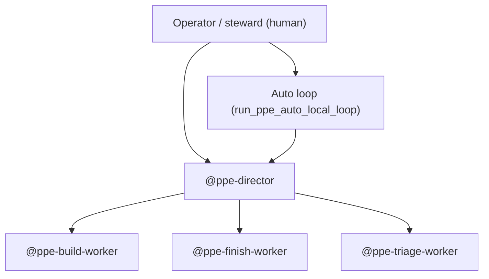

# PPE operator map v1

**Plane:** CONTROL-PLANE. **Purpose:** one-page map from verdict → agent → artifact → command (Paperclip-inspired visibility, git-native).

Cross-refs: [`PPE_IDE_NATIVE_OPERATOR_V1.md`](PPE_IDE_NATIVE_OPERATOR_V1.md) · [`PPE_MOBILE_OPERATOR_V1.md`](PPE_MOBILE_OPERATOR_V1.md) · [`RELAY_ORCHESTRATOR_RUNBOOK_V1.md`](RELAY_ORCHESTRATOR_RUNBOOK_V1.md)

---

## Org (flat tree)



Humans sit at the top for SELECTION and hard stops. The **loop** drives control/witness/closeout slices unattended. **Director** spawns one worker per interrupt — never implements product code.

---

## Verdict → action

| Verdict | Owner | Agent | Read first | Do next |
|---------|-------|-------|------------|---------|
| `RUN_AUTO` | loop | — | `OPERATOR_STATUS.md` | Leave loop running |
| `RUN_LOCAL` | IDE | `@ppe-finish-worker` | `IDE_PRODUCT_READY.json` | `ppe_go.cmd` or `run_ppe_local.cmd` |
| `IDE_BUILD` | IDE | `@ppe-build-worker` | `IDE_BUILD_STARTER_*.md`, `ACTIVE_IDE_SLICE.json` | `ppe_go.cmd` |
| `FIX_PLAN` | triage | `@ppe-triage-worker` | `OPERATOR_GUARD_REPORT.md` | `ppe_go.cmd` |
| `STALE_STATE` | triage | `@ppe-triage-worker` | `LAST_RUN_REPORT.md` | `ppe_go.cmd` |
| `ERROR` | triage | `@ppe-triage-worker` | `OPERATOR_STATUS.md` | `ppe_go.cmd` |
| `SUPPLY_LOW` | steward | — | `PHASE_CHAPTER_BACKLOG.json` | Queue chapter or SELECTION |

Refresh status anytime:

```bat
python scripts/ppe_operator_status.py
run_ppe_operator.cmd --brief
```

---

## Artifacts (source of truth)

| Artifact | Role |
|----------|------|
| `artifacts/orchestrator/OPERATOR_STATUS.md` | **Inbox** — owner, active slice, blocker, next command, queue preview |
| `artifacts/orchestrator/BLOCKERS.md` | **Triage inbox** — one file for `@ppe-triage-worker` |
| `artifacts/orchestrator/ACTIVE_IDE_SLICE.json` | Checkout lock while IDE BUILD in flight |
| `artifacts/orchestrator/IDE_BUILD_STARTER_*.md` | One-file BUILD bundle for product slices |
| `artifacts/orchestrator/IDE_PRODUCT_READY.json` | Product slice committed; allows `run_ppe_local` |
| `docs/SOP/AGENT_CONTINUITY_BRIEF.md` | Steering after chapter closeout — new thread only |
| `docs/SOP/PHASE_QUEUE.json` | Next `READY` chapters (preview in status) |

---

## Phone workflow (30 seconds)

1. ntfy fires → Termius: `run_ppe_operator.cmd --brief`
2. Read **Inbox** section in `OPERATOR_STATUS.md`
3. If `IDE_BUILD` / triage → RDP + `ppe_go.cmd` → paste in Cursor Agent

---

## Agent hiring rule

New Cursor subagents under `.cursor/agents/` require a **backlog or SELECTION note** — do not add roles silently mid-BUILD. See [`BACKLOG_OPERATOR.md`](BACKLOG_OPERATOR.md).

---

## Related chapters

- [`POST_PPE_OPERATOR_VISIBILITY_V1_SELECTION.md`](POST_PPE_OPERATOR_VISIBILITY_V1_SELECTION.md) — visibility v1 charter
- [`SPRINT_PPE_OPERATOR_VISIBILITY_V1.md`](SPRINT_PPE_OPERATOR_VISIBILITY_V1.md) — slice map
