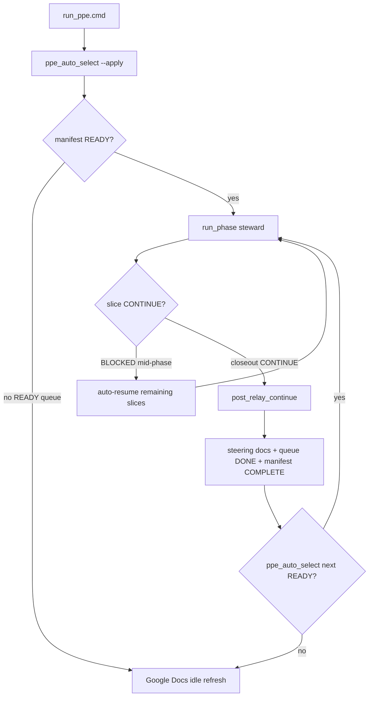

# PPE unified auto-run (operator + agents) — v1

**Purpose:** single checklist for “run the machine” without hand-editing steering docs or guessing what happens next.

**Entry point (repo root only):** `run_ppe.cmd`

Related: [`RELAY_ORCHESTRATOR_RUNBOOK_V1.md`](RELAY_ORCHESTRATOR_RUNBOOK_V1.md), [`ACTIVE_PHASE_MANIFEST.md`](ACTIVE_PHASE_MANIFEST.md), [`GOOGLE_DOCS_CONTROL_PLANE_V1.md`](GOOGLE_DOCS_CONTROL_PLANE_V1.md).

---

## End-to-end flow (default)

---

## Before you run

1. **Queue:** add the next chapter to [`PHASE_QUEUE.json`](PHASE_QUEUE.json) as **`READY`** (requires a valid [`PHASE_PLANS/*.json`](PHASE_PLANS/) with a closeout slice).
2. **SELECTION record:** outcome doc under `docs/SOP/POST_*_SELECTION_OUTCOME.md`.
3. **Credentials (optional):** `.env.mcp` or OAuth env for MSOS mirror push on queue idle (see [`GOOGLE_DOCS_CONTROL_PLANE_V1.md`](GOOGLE_DOCS_CONTROL_PLANE_V1.md)).
4. **Orchestrator:** `ppe-orchestrator-acp` sibling repo available (see runbook).

---

## Commands

| Command | When |
|---------|------|
| `run_ppe.cmd` | Default: one chapter (auto-select if manifest empty/COMPLETE), auto-resume, auto-chain **one** next READY chapter, Google Docs on idle |
| `run_ppe.cmd --continuous` | Up to 5 chapters while queue has `READY` items |
| `run_ppe.cmd --dry-run` | Preflight only |
| `run_ppe.cmd --status` | ACTIVE_RUN + LAST_RUN_REPORT pointers |
| `run_ppe.cmd --select-only` | Preview auto-select JSON only |
| `run_ppe.cmd --no-auto-chain` | Do not start next queue chapter after closeout |
| `run_ppe.cmd --slice <id>` | Single slice escape hatch (still auto-chains if chapter completes + queue has READY) |
| `PPE_GOOGLE_DOCS_ON_IDLE=0` | Skip MSOS mirror refresh when queue idle |
| `PPE_AUTO_CHAIN=0` | Same as `--no-auto-chain` |

---

## What updates automatically

| Artifact | When |
|----------|------|
| `MVP1_FRONTIER.md`, `HANDOFF.md`, `PPE_INTEGRATED_STATUS.md`, `AGENT_CONTINUITY_BRIEF.md` | Closeout slice `CONTINUE` → `apply_control_closeout_v1` |
| `PHASE_QUEUE.json` item → **DONE** | `post_relay_continue` after chapter closeout |
| `ACTIVE_PHASE_MANIFEST.json` → **COMPLETE**, `phasePlanPath` cleared | Same |
| `artifacts/msos_repo_truth_snapshot.md` | Queue idle (always) |
| MSOS Google Doc marker block | Queue idle, if OAuth configured |
| **PPE Master** Google Doc | **Never** (steward only) |

---

## When the queue runs out

1. Manifest: **`COMPLETE`**, empty `phasePlanPath`.
2. `run_ppe.cmd` runs **Google Docs idle refresh** (best-effort).
3. Report: `artifacts/control_plane/google_docs_idle_refresh.json`.
4. **Steward SELECTION:** charter next chapter → set queue **`READY`** → `run_ppe.cmd` again.

Prep doc after Sprint 003: [`POST_MVP1_SPRINT003_SELECTION.md`](POST_MVP1_SPRINT003_SELECTION.md).

---

## Recovery

| Symptom | Action |
|---------|--------|
| Phase exit **40** / `REPO_STATE_DRIFT` mid-chapter | Re-run `run_ppe.cmd` (auto-resume) or `run_ppe.cmd --slice <remainingSliceId>` |
| Promotion blocked (`main` locked in worktree) | Promote from checkout that owns `main`, or let closeout worker rebase onto `origin/main` |
| Google Doc not updated | Check `.env.mcp` / OAuth; run `python scripts/sync_msos_repo_truth.py` + `python scripts/google_docs_sync.py --sync-repo-to-mirror --write-report` |
| Stale steering | Do **not** hand-edit; re-run closeout slice with relay `CONTINUE` or recovery closeout |

---

## After exit

1. Read `artifacts/orchestrator/LAST_RUN_REPORT.md`.
2. **New** Cursor thread with `AGENT_CONTINUITY_BRIEF.md` only ([`CONTEXT_RULES.md`](../CONTEXT_RULES.md)).
3. Ship: feature branch → PR → `main` ([`GITHUB_ZERO_TOUCH_MERGE.md`](GITHUB_ZERO_TOUCH_MERGE.md)).

---

## Agent rules (summary)

- Do **not** stop after closeout if user asked for auto cycle and queue has **READY** items.
- Do **not** hand-edit HANDOFF/FRONTIER during BUILD.
- SELECTION = queue + phase plan + outcome doc; then `run_ppe.cmd`.
