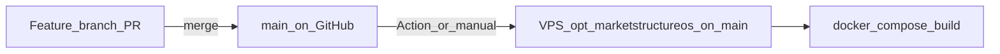

# Production deploy protocol

Single place for **how production is supposed to run**: what branch, what server path, how `git` and Docker fit together, and how GitHub Actions fits in. First-time machine setup (TLS, Caddy, Cloudflare, backups) stays in [RUNBOOK_VPS_CLOUDFLARE_ACCESS.md](../DEPLOY/RUNBOOK_VPS_CLOUDFLARE_ACCESS.md).

## A) Canonical rules

- **Production source of truth:** branch **`main`** on GitHub for this repository.
- **VPS working copy:** `/opt/marketstructureos` should have **`HEAD` on `main`**. Before you trust a deploy, run `git status` and confirm `On branch main`. Deploying from a long-lived feature branch (for example `notifications` for local integration work) makes the live site drift from what you merge elsewhere and **does not** match the default GitHub Action (which runs on **`main`** pushes).
- **What runs in Docker:** the commit checked out in that directory after `git pull` on **`main`**, then `docker compose up -d --build` (see [Dockerfile](../../Dockerfile) `COPY . /app`).

**If you must deploy a branch other than `main`:** check out that branch on the VPS *and* change [`.github/workflows/deploy-vps.yml`](../../.github/workflows/deploy-vps.yml) to trigger on that branch. The default protocol below assumes **`main`**.

## B) One-time bootstrap (do once, or when rebuilding access)

Work through these once per VPS (or when keys/users change). Details and security notes: [GITHUB_ACTIONS_VPS_DEPLOY.md](../DEPLOY/GITHUB_ACTIONS_VPS_DEPLOY.md).

1. **Repo on disk:** `/opt/marketstructureos` is a clone of the GitHub repository configured as **`origin`** (same repo the Actions workflow and deploy keys target).
2. **Branch alignment:**  
   `cd /opt/marketstructureos`  
   `git fetch origin`  
   `git checkout main`  
   `git pull origin main`  
   Confirm with `git branch` and `git log -1 --oneline`.
3. **Git “dubious ownership”:** if you run `git` as a different user than the directory owner, either use the owning user for all `git`/`docker` work or add `git config --global --add safe.directory /opt/marketstructureos` for that user (prefer non-root owner + consistent user).
4. **Non-interactive `git pull`:** add a **read-only deploy key** on the GitHub repo and the matching private key + `~/.ssh/config` block for `Host github.com` / `IdentityFile` on the VPS (so `git pull` never prompts).
5. **Docker:** the deploy user can run `docker compose` in `/opt/marketstructureos` (typically **member of `docker` group**). If you require `sudo`, update the workflow script or manual commands accordingly.
6. **GitHub Actions:** add repository secrets `VPS_HOST`, `VPS_USER`, `VPS_SSH_PRIVATE_KEY`; merge [deploy-vps.yml](../../.github/workflows/deploy-vps.yml) to **`main`**; confirm a green **Deploy VPS** run (push to `main` or **Run workflow**).

## C) Standard release protocol (every change you ship)

**Zero-touch merge policy (when tests pass):** do not use a standing human merge approval for routine work. Open a PR to **`main`**, enable **auto-merge**, and let GitHub merge when required checks (**`CI / pytest`** and **`CI / docker_entrypoint`**) pass. Full checklist and branch-protection settings: [GITHUB_ZERO_TOUCH_MERGE.md](GITHUB_ZERO_TOUCH_MERGE.md).

1. Implement on a **feature branch**; open a PR to **`main`** when ready; enable **auto-merge** on the PR.
2. Wait for **`CI / pytest`** and **`CI / docker_entrypoint`** to pass; GitHub merges to **`main`** without a manual merge click when auto-merge is enabled.
3. **Deploy:** pushes to **`main`** trigger [deploy-vps.yml](../../.github/workflows/deploy-vps.yml) when secrets are set. Optionally confirm **Actions → Deploy VPS** for that commit, or use **Run workflow** to redeploy the same commit.
4. **If Actions is off or failing:** SSH to the VPS and run the manual block (same as [DEMO_UI_RELEASE_CHECKLIST.md](DEMO_UI_RELEASE_CHECKLIST.md) §4), but **first** ensure you are on **`main`**:  
   `cd /opt/marketstructureos`  
   `git checkout main && git pull origin main`  
   `docker compose up -d --build`
5. **Post-deploy smoke:**  
   - **Automated:** [deploy-vps.yml](../../.github/workflows/deploy-vps.yml) curls `https://marketstructureos.com/` and fails if the HTML contains `ModuleNotFoundError` or a Python traceback.  
   - **Steward (optional cadence):** confirm the demo loads as expected; DevTools → Network: `/static/js/` loads over **https**; `https://app.marketstructureos.com` — Cloudflare Access and full app after login (see runbook).

## D) Troubleshooting

| Symptom | What to check |
|--------|----------------|
| `git status` not on `main` | `git checkout main`, `git pull origin main`; avoid leaving production on a feature branch. |
| `Permission denied (publickey)` on `git pull` | Deploy key on repo; `~/.ssh/config` for `github.com`; key file permissions (`chmod 600` on private key). |
| GitHub Action fails on SSH step | Secrets names and values; `authorized_keys` on VPS for `VPS_USER`; host firewall allows SSH. |
| `git pull` works but site unchanged | Run `docker compose up -d --build`; hard-refresh browser. |
| Action succeeds but old UI | Wrong branch on server or wrong repo; verify `git log -1` on VPS matches GitHub `main`. |

## Related docs

- [GITHUB_ZERO_TOUCH_MERGE.md](GITHUB_ZERO_TOUCH_MERGE.md) — auto-merge when checks pass; branch protection; steward outside the merge path.  
- [DEMO_UI_RELEASE_CHECKLIST.md](DEMO_UI_RELEASE_CHECKLIST.md) — local smoke, tests, manual §4 commands, smoke list.  
- [GITHUB_ACTIONS_VPS_DEPLOY.md](../DEPLOY/GITHUB_ACTIONS_VPS_DEPLOY.md) — secrets, triggers, disable automation.  
- [RUNBOOK_VPS_CLOUDFLARE_ACCESS.md](../DEPLOY/RUNBOOK_VPS_CLOUDFLARE_ACCESS.md) — first-time VPS, Caddy, Access, backups.
