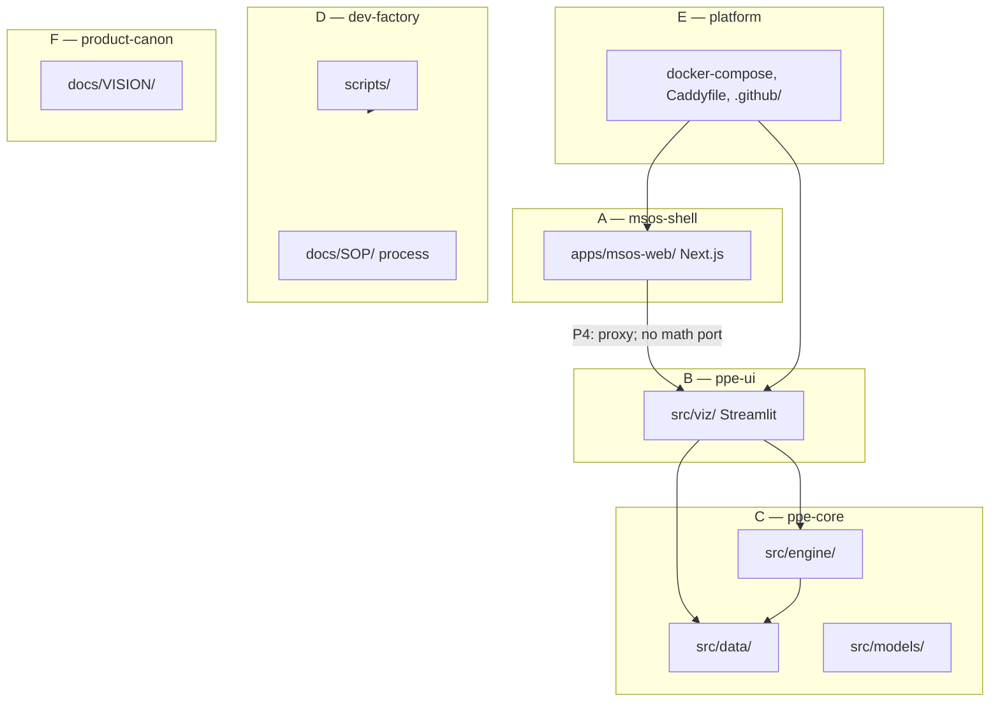

# Repo layer map v1

**Status:** Accepted (2026-06-01)  
**Purpose:** Delineate where code and docs live so MSOS, PPE, and the dev factory can evolve in parallel without spaghetti.  
**Machine-readable presets:** [`REPO_LAYER_PATH_PREFIXES.json`](REPO_LAYER_PATH_PREFIXES.json)  
**ADR (stack):** [`MSOS_P1_STACK_ROUTING_ADR.md`](MSOS_P1_STACK_ROUTING_ADR.md) · **MSOS program:** [`MSOS_WEBSITE_PROGRAM.md`](MSOS_WEBSITE_PROGRAM.md)

---

## How this relates to “plane” discipline

| Concept | Question it answers | Examples |
|---------|---------------------|----------|
| **Plane** (`OPERATING_RULES.md`) | What *kind* of execution step is this? | `CONTROL-PLANE`, `PRODUCT-PLANE`, `EVIDENCE-PLANE` |
| **Layer** (this doc) | *Where* in the repo may this slice touch? | `ppe-ui`, `msos-shell`, `dev-factory` |

Every BUILD packet must declare **both** `PLANE` and `LAYER` (or `LAYER_PRESET`). Do not mix layers in one slice unless `RECOVERY` or an explicit steward exception is recorded.

---

## Four product layers + two supporting areas



| Layer ID | Name | Owns truth for | Primary paths |
|----------|------|----------------|-----------------|
| `msos-shell` | A — MSOS platform shell | Homepage, Command Center chrome, honest Live/Soon labels | `apps/msos-web/` (future), MSOS frontier/docs |
| `ppe-ui` | B — PPE Streamlit UI | Lab layout, panels, MVP1 decision surface presentation | `src/viz/` |
| `ppe-core` | C — PPE engine | Distributions, disagreement math, fetchers, schemas | `src/engine/`, `src/data/`, `src/models/` |
| `dev-factory` | D — Dev factory | Relay, queue, closeout, steward automation | `scripts/`, `docs/SOP/` (process) |
| `platform` | E — Shared platform | VPS routing, containers, CI deploy | `docker-compose.yml`, `Caddyfile`, `.github/`, `docs/DEPLOY/` |
| `product-canon` | F — Product canon | Vision, MSOS storyboard, PPE Master imports | `docs/VISION/` |

**Hierarchy (product, not folders):** MSOS → Command Center → Strategy Lab → **PPE** (first tool) → BTC options (first surface). See [`MSOS_WEBSITE_PROGRAM.md`](MSOS_WEBSITE_PROGRAM.md).

---

## Folder map (current + near future)

```
Probability prediction engine/
├── apps/
│   └── msos-web/              # A — Next.js (chartered P2+; add when slice ships)
├── config/                    # shared product config
├── src/
│   ├── data/                  # C
│   ├── engine/                # C
│   ├── models/                # C
│   └── viz/                   # B — Streamlit; keep app.py thin
├── scripts/                   # D
├── tests/                     # mirrors B, C, D (and A when present)
├── docs/
│   ├── VISION/                # F
│   ├── SOP/                   # D (+ MSOS/MVP1 steering)
│   └── DEPLOY/                # E
├── docker-compose.yml         # E
├── Caddyfile                  # E
└── .github/workflows/         # E
```

---

## Import and dependency rules (hard)

| From → To | Allowed? |
|-----------|----------|
| `apps/msos-web/*` → `src/*` | **No** (different runtime; use HTTP/proxy/iframe per ADR) |
| `src/viz/*` → `src/engine`, `src/data`, `src/models` | **Yes** |
| `src/engine/*` → `src/viz/*` | **No** |
| `src/data/*` → `src/viz/*` | **No** |
| `src/engine/*` → `src/data/*` | **Yes** (when needed) |
| TypeScript reimplementation of PPE math | **No** — display only; C remains authoritative |
| `scripts/*` → `src/*` | **Sparingly** — tooling/tests only; not product UI |

**PPE UI file-size:** add new surfaces as modules under `src/viz/` (`app_panels.py`, `mvp1_*.py`, `implied_lab_*.py`); avoid growing `app.py` without bound.

**Deferred (P5+):** `src/api/` or read APIs — only after thesis persistence SELECTION; MSOS may consume HTTP, not duplicate math.

---

## Layer presets (BUILD packets)

Copy a preset from [`REPO_LAYER_PATH_PREFIXES.json`](REPO_LAYER_PATH_PREFIXES.json) into every BUILD packet. Steward sets `LAYER` + `ALLOWED_PATHS` + `FORBIDDEN_PATHS`.

| Preset | Layer | Typical plane | Parallel-safe with |
|--------|-------|---------------|-------------------|
| `MSOS_UI` | `msos-shell` | `PRODUCT-PLANE` | `PPE_UI`, `PPE_CORE`, `CONTROL`, `DOCS_CANON` |
| `PPE_UI` | `ppe-ui` | `PRODUCT-PLANE` | `MSOS_UI`, `PPE_CORE`, `CONTROL` |
| `PPE_CORE` | `ppe-core` | `PRODUCT-PLANE` | `MSOS_UI`, `PPE_UI`, `CONTROL` |
| `CONTROL` | `dev-factory` | `CONTROL-PLANE` or `EVIDENCE-PLANE` | `MSOS_UI`, `PPE_UI`, `PPE_CORE`, `DOCS_CANON` |
| `PLATFORM` | `platform` | `PRODUCT-PLANE` or `EVIDENCE-PLANE` | `DOCS_CANON`, `CONTROL` (coordinate Caddy changes) |
| `DOCS_CANON` | `product-canon` | `CONTROL-PLANE` | Most presets if docs-only |
| `DOCS_ONLY` | (none) | `CONTROL-PLANE` | All (Tier 0 gate) |
| `MSOS_PROXY` | `msos-shell` + `platform` | `PRODUCT-PLANE` | Requires steward sign-off; P4 integration |

**Non-widening:** MSOS slices must not change MVP1 evidence contracts or PPE math semantics unless the sprint explicitly says so ([`MSOS_WEBSITE_PROGRAM.md`](MSOS_WEBSITE_PROGRAM.md)).

---

## Ownership matrix

| If you change… | Primary layer | Local gate (typical) | Extra merge check |
|----------------|---------------|----------------------|-------------------|
| `apps/msos-web/` | `msos-shell` | Node lint/test (when added) | MSOS frontier |
| `src/viz/` | `ppe-ui` | Tier 2 + dual implied-lab smoke if lab touched | MVP1 frontier |
| `src/engine/`, `src/data/`, `src/models/` | `ppe-core` | Tier 2 | MVP1 frontier |
| `scripts/`, `tests/` (no `src/`) | `dev-factory` | Tier 1 | — |
| `docs/SOP/` only | `dev-factory` | Tier 0–1 | — |
| `docs/VISION/` | `product-canon` | Tier 0–1 | Storyboard gate for P2+ |
| `docker-compose`, `Caddyfile`, `.github/` | `platform` | CI docker job | Deploy runbook |

Canonical gates: [`COMMIT_POLICY.md`](COMMIT_POLICY.md) · `python scripts/run_pushable_gate.py`

---

## Integration boundaries (MSOS waterfall)

| Phase | Layer touch | Mechanism |
|-------|-------------|-----------|
| P1 | `product-canon`, `dev-factory` | ADR only ([`MSOS_P1_STACK_ROUTING_ADR.md`](MSOS_P1_STACK_ROUTING_ADR.md)) |
| P2 | `msos-shell`, `platform` | `apps/msos-web/`, Caddy on apex |
| P3 | `msos-shell` | Auth routes + Cloudflare Access |
| P4 | `msos-shell`, `platform`, `ppe-ui` (config only) | Caddy reverse proxy → Streamlit; no TS math |
| P5+ | may add `ppe-core` API | Read APIs; still no math in frontend |

---

## “Where does this go?” cheat sheet

| Building… | Put it in… | Never… |
|-----------|------------|--------|
| Homepage, investor narrative | `apps/msos-web/` | `src/viz/` |
| Implied lab chart / belief toggles | `src/viz/` | Next.js app |
| Distribution / disagreement math | `src/engine/` | Streamlit callbacks as source of truth |
| Market data fetch | `src/data/` | duplicated in UI |
| Relay / queue / closeout | `scripts/` + `docs/SOP/` | `src/viz/` |
| PPE Master / storyboard | `docs/VISION/` | only in chat |
| TLS, demo vs full hosts | `Caddyfile` + `docker-compose.yml` | hardcoded in app logic |

---

## Parallel development

1. **One active layer per BUILD thread** unless paths are disjoint and steward authorized two chapters.
2. **Orchestrator worktrees** (`_worktrees/orchestrator/<slice>/`) — one slice, one layer preset.
3. **Branch naming (optional):** `msos/p2-*`, `ppe/mvp1-*`, `control/relay-*`.
4. **BUILD packet** must list `ALLOWED_PATHS` / `FORBIDDEN_PATHS`; worker stays inside them.
5. **Violations:** if `git diff` touches a forbidden prefix, stop and report scope expansion — do not “fold in” adjacent layers.

---

## Agent load order (BUILD)

1. This doc OR the `LAYER_PRESET` block in the BUILD packet  
2. Active sprint spec  
3. [`AGENT_CONTINUITY_BRIEF.md`](AGENT_CONTINUITY_BRIEF.md)  
4. Layer-specific frontier: [`MVP1_FRONTIER.md`](MVP1_FRONTIER.md) or [`MSOS_FRONTIER.md`](MSOS_FRONTIER.md)

Cursor: [`.cursor/rules/repo-layers.mdc`](../../.cursor/rules/repo-layers.mdc) (always on for implementation paths).

## Automation integration

| System | Behavior |
|--------|----------|
| **Relay** (`relay_runtime_v0.py`) | `task_envelope.json` includes `repo_layer`; `resume` audits build-branch diff → `STOP_FOR_REVIEW` on violation |
| **Orchestrator** (`phase_orchestrator_v0.py`) | Resolves `layerPreset` from phase plan; passes `--repo-layer-json` to relay; worker prompt lists allowed paths |
| **Preflight** (`ppe_preflight.py`) | When manifest `RUNNING`/`READY` or `ACTIVE_RUN`, audits dirty paths vs active slice scope |
| **Pushable gate** (`run_pushable_gate.py`) | Tier 1/2: infers preset from changed files (disable with `PPE_LAYER_AUDIT=0`) |
| **CLI** | `python scripts/ppe_layer_audit.py` — see [`PARALLEL_AGENT_CHECKLIST_V1.md`](PARALLEL_AGENT_CHECKLIST_V1.md) |

---

## Related documents

- [`BUILD_PACKET_TEMPLATE.md`](BUILD_PACKET_TEMPLATE.md) — required `LAYER` / path fields  
- [`OPERATING_RULES.md`](OPERATING_RULES.md) — plane discipline  
- [`MSOS_P1_STACK_ROUTING_ADR.md`](MSOS_P1_STACK_ROUTING_ADR.md) — stack decisions  
- [`ARCHITECT_NOTES.md`](../ARCHITECT_NOTES.md) — Streamlit constraint for PPE core UI
