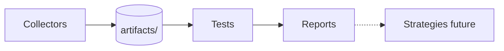

# Research pipeline v1 — collect, test, trade (later)

**Purpose:** One map for **edge research** — separate **collectors** (save snapshots), **tests** (ask questions of archives), and **strategies** (future trade rules). Cross-venue PM ↔ options is the reference template.

**Visual:** [`assets/msos_module_map.html`](assets/msos_module_map.html) § Research pipeline  
**Module registry:** [`PPE_MODULE_REGISTRY_V1.md`](PPE_MODULE_REGISTRY_V1.md)

---

## Three layers

| Layer | Question | Output | Status |
|-------|----------|--------|--------|
| **Collector** | What did markets say at time T? | Timestamped archive under `artifacts/` | **LIVE** (several) |
| **Test** | Does this pattern mean anything? | Report JSON/MD under `artifacts/` | **LIVE** (cross-venue) + planned |
| **Strategy** | If proven, what rule would we trade? | Signal spec → execution (out of scope) | **DEFERRED** |

**Rule:** Tests read **archives that match their contract**. Not every collector plugs into every test.

---

## Archive contract (required per collector)

Before chartering a new collector, define:

| Field | Example (cross-venue) |
|-------|------------------------|
| `collector_id` | `cross_venue_event_gap` |
| **Why collect** | Score PM vs options-implied gaps over time |
| **What subset** | BTC Polymarket price-target questions + Deribit marks |
| **How often** | Daily 07:15 VM (`install_cross_venue_collector_task.cmd`) |
| **Archive path** | `artifacts/cross_venue_snapshots/YYYY-MM-DD/*.csv` |
| **Contract** | `src/viz/cross_venue_export.py` → `CSV_COLUMNS` |
| **Who consumes** | `run_cross_venue_scan.py`, `run_cross_venue_backtest.py` |

---

## Collector registry

| ID | Script | Archive | Cadence | Module class |
|----|--------|---------|---------|--------------|
| `cross_venue_event_gap` | `scripts/collect_cross_venue_snapshot.py` | `artifacts/cross_venue_snapshots/` | Daily VM | EVENT_GAP |
| `options_horizon_surface` | `scripts/collect_horizon_surface_snapshot.py` | `artifacts/horizon_surface_archive/` | Daily VM | PROJECTION / REPLAY |
| `implied_distribution_ts` | `scripts/collect_distribution_stats_snapshot.py` | `artifacts/distribution_snapshots/` | Daily VM (planned task) | DISTRIBUTION |
| `forward_consistency_ts` | *(planned T3)* | `artifacts/forward_consistency/` *(TBD)* | Daily VM *(after radar)* | CONSISTENCY |

Ops runbooks: [`CROSS_VENUE_COLLECTOR_OPS_V1.md`](CROSS_VENUE_COLLECTOR_OPS_V1.md) · [`HORIZON_SURFACE_COLLECTOR_OPS_V1.md`](HORIZON_SURFACE_COLLECTOR_OPS_V1.md)

---

## Test registry

| ID | Script | Reads archive | Delivers | Strategy-ready? |
|----|--------|---------------|----------|-----------------|
| `cross_venue_scan` | `scripts/run_cross_venue_scan.py` | `cross_venue_snapshots/` | `artifacts/cross_venue_reports/latest.md` | No — screening only |
| `cross_venue_backtest` | `scripts/run_cross_venue_backtest.py` | `cross_venue_snapshots/` | `artifacts/cross_venue_backtest/latest_report.md` | **Future** — after tradeability layer |
| `horizon_replay_scrubber` | *(UI chapter)* | `horizon_surface_archive/` | MSOS `/options-horizon` scrubber | No |
| `forward_consistency_radar` | live API + *(archive T3)* | live quotes; archive TBD | `/ppe-display-api/forward-consistency.json` | No |

Tests declare `--min-snapshots` (or equivalent) and **pending** reasons when history is thin.

---

## Reference template — cross-venue (Collector A + Test B)

**Hypothesis:** Polymarket and Deribit options sometimes disagree on P(BTC > K); one side may be more accurate after resolve.

| Step | Command | Artifact |
|------|---------|----------|
| Collect | `collect_cross_venue_snapshot.cmd` | `…/ppe_cross_venue_prob_panel_HHMMSSZ.csv` |
| Screen | `run_cross_venue_scan.cmd --latest-snapshot` | `cross_venue_reports/latest.md` |
| Test | `run_cross_venue_backtest.cmd` | `cross_venue_backtest/latest_report.md` |
| Daily pipeline | `run_cross_venue_daily.cmd` | collect + screen (backtest weekly) |

**Scoring:** Brier score — first snapshot probability vs resolved outcome (`src/viz/cross_venue_backtest.py`). Needs ≥14 snapshots per question **and** a resolved event.

**Not in scope:** auto-trade, Polymarket execution, ntfy on gaps.

Program: [`MVP1_CROSS_VENUE_QUANT_PROGRAM_V1.md`](MVP1_CROSS_VENUE_QUANT_PROGRAM_V1.md)

---

## Strategy layer (deferred)

A strategy consumes **test reports**, not raw CSVs:

1. Report shows stable edge (e.g. gap bucket calibration)
2. Tradeability check (spreads, fees, both legs executable) — partial today via `spread_cost_usd` columns
3. Human charters strategy spec
4. Separate execution milestone — not PPE MVP1

---

## Adding a new collector + test pair

1. Steward SELECTION + archive charter (this doc + registry row)
2. Implement `scripts/collect_<name>.py` → fixed schema under `artifacts/<name>/`
3. Unit tests for contract columns / JSON shape
4. Implement `scripts/run_<name>_<test>.py` that **only** reads matching archives
5. Ops runbook + optional VM install cmd
6. Update this doc, `PPE_MODULE_REGISTRY_V1.md`, and `msos_module_map.html` (research pipeline table)

---

## Changelog

| Date | Change |
|------|--------|
| 2026-06-30 | v1 — three-layer model; cross-venue template; collector/test registries |
