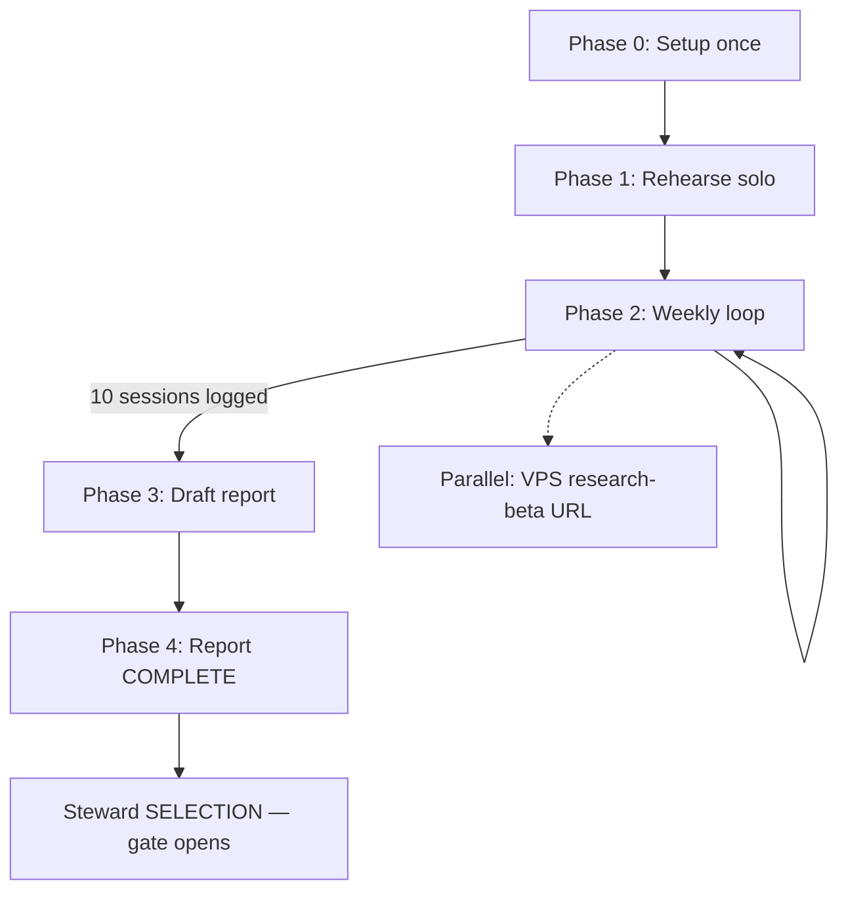

# Steward validation guide v1 — step-by-step

**For:** you (human operator), not agents.  
**Follows:** Mon 13:00 + Thu 20:00 nudges · [`STEWARD_OPERATOR_V1.md`](STEWARD_OPERATOR_V1.md)  
**Strategic why:** [`PRODUCT_FOCUS_PLAYBOOK_V1.md`](PRODUCT_FOCUS_PLAYBOOK_V1.md)  
**Receipt log:** [`VALIDATION_REALITY_CHECKS.md`](VALIDATION_REALITY_CHECKS.md) § MSOS P8

---

## Why this whole plan exists

| Fact | What it means for you |
|------|------------------------|
| Agents can **ship code** all day | They cannot prove anyone **wants** the product |
| The auto-build loop has a **focus gate** | New chapters stay blocked until **you** finish validation evidence |
| Peers (Coinbase, SpotGamma, Plaid) won on **one wedge + real users** first | Platform polish without testers = Quantopian risk |
| Your job is **P0 wedge proof** | 10 guided sessions logged → validation report **COMPLETE** → next SELECTION |

**North star (say this in every session):**  
*See what BTC options imply, where you disagree, and what payoff fits — in under 15 seconds.*

**Founder crib sheet (5 concepts, no equations):** [`FOUNDER_OPERATOR_CRIB_SHEET_V1.md`](FOUNDER_OPERATOR_CRIB_SHEET_V1.md)

**Phone session notebook:** [`OPERATOR_SESSION_NOTEBOOK_V1.md`](OPERATOR_SESSION_NOTEBOOK_V1.md) · `https://marketstructureos.com/session.html` — step-by-step on your phone; updates via repo JSON.

If you only read one section: **Phase 2 — weekly loop** below.

---

## Phone pings + walkthrough (automation)

**Mon 13:00** and **Thu 20:00** nudges include:

| Section | What it tells you |
|---------|-------------------|
| **Where you are** | Plan phase (start → weekly loop → report) |
| **Why this ping** | Why *today* matters |
| **Why the plan** | Why agents wait on you |
| **What you get out of it** | Unlock gate, 15-second proof, avoid drift |
| **This week** | One concrete weekly goal |
| **Your moves now** | Numbered steps to do right now |

**Review the full plan anytime (agree before you execute):**

```bat
python scripts\ppe_steward_scoreboard.py --walkthrough
```

Preview what a ping looks like without sending:

```bat
python scripts\ppe_steward_nudge.py --dry-run --slot monday
python scripts\ppe_steward_nudge.py --dry-run --slot thursday
```

---

## The journey (four phases)



| Phase | Goal | Time |
|-------|------|------|
| **0** | Ntfy + scheduler + outreach list | ~30 min once |
| **1** | You can run demo alone in 5 min | ~15 min once |
| **2** | Repeat weekly until **10 rows** logged | ~30 min/week + 1 session |
| **3** | Roll metrics into validation report | ~45 min after ~3 sessions; refine at 10 |
| **4** | Sign off report → **COMPLETE** | ~1 hr |

Track progress anytime:

```bat
python scripts\ppe_steward_scoreboard.py
```

---

## Phase 0 — Setup (do once)

### Step 0.1 — Steward phone channel

| | |
|---|---|
| **Why** | Mon/Thu pings only work on a **separate** topic — not mixed with loop alerts |
| **How** | [`STEWARD_OPERATOR_V1.md`](STEWARD_OPERATOR_V1.md) § One-time setup |

Checklist:

- [ ] `PPE_NTFY_STEWARD_TOPIC` in `ppe_operator_notify.local.cmd`
- [ ] Subscribed in ntfy app (second subscription)
- [ ] `python scripts\ppe_notify_push.py --steward-test` → ping received
- [ ] `install_steward_nudge_task.cmd` → Mon **13:00**, Thu **20:00**

### Step 0.2 — Build your outreach list (3–10 names)

| | |
|---|---|
| **Why** | Monday fails when you hunt for contacts instead of sending one text |
| **How** | Spreadsheet or notes — columns: Name, how you know them, BTC options? Y/N, last contacted |

**Good first testers:** active Deribit BTC options, vol traders, quant friends who trade options.  
**Also OK for sessions 1–3:** smart quant-curious friends — log honestly in “Tester profile”.

Template row:

```text
Alex — former desk colleague — trades BTC opts on Deribit — not contacted yet
```

### Step 0.3 — Know your demo URL

| | |
|---|---|
| **Why** | Broken link kills trust in session 1 |
| **How** | Open `https://marketstructureos.com` on phone + desktop before any outreach |

Optional parallel (not blocking session 1): VPS research-beta CTA — [`COMMERCIAL_OPS_COMPLETION.md`](COMMERCIAL_OPS_COMPLETION.md).

---

## Phase 1 — Rehearse solo (before first live session)

Run this **alone** once. Time yourself (~5 min).

| Step | What to do | Why it matters |
|------|------------|----------------|
| 1 | Open `https://marketstructureos.com` | Same URL you’ll send testers |
| 2 | Follow [`DEMO_OPERATOR_SCRIPT.md`](DEMO_OPERATOR_SCRIPT.md) start to finish | Timing + wording become muscle memory |
| 3 | Say aloud: “Purple/orange = market-implied vs benchmark — not advice” | Sets compliance tone |
| 4 | Click a **preset** in implied lab; watch payoff line move | Core “15 second” moment |
| 5 | Open disagreement readout; explain in plain English | Tests whether *you* understand the wedge |
| 6 | Ask yourself: “What was the main object on screen?” | Same question you ask testers (comprehension check) |

**Pass:** you finish in ~5–7 min without getting lost.  
**Fail:** fix URL/env first — do not invite anyone until solo run works.

---

## Phase 2 — Weekly loop (repeat until 10 sessions)

This is what **Mon 13:00** and **Thu 20:00** nudges drive.

### Monday 13:00 — Book outreach (~5 min)

| | |
|---|---|
| **Why** | Validation is a **calendar problem**, not a code problem — no hold = no session |
| **How** | One text, one calendar block before Thursday |

**Steps:**

1. Run scoreboard (optional): `python scripts\ppe_steward_scoreboard.py`
2. Pick **one name** from your list (rotate; don’t spam the same person weekly)
3. Send a message (copy/edit):

```text
Hey [Name] — I'm building a BTC options research demo (market-implied vs your view, ~5 min walkthrough). Would you have 20–30 min this week for a guided look? No pitch — just want honest feedback from someone who trades options.
```

4. When they reply, **calendar hold** 20–30 min Tue–Thu
5. Send link: `https://marketstructureos.com`

**If no reply:** pick the next name next Monday — don’t wait for perfect.

---

### Tuesday–Wednesday — Run the session (~20–30 min)

| | |
|---|---|
| **Why** | Same script every time = comparable rows in the log → credible report |
| **How** | Screen share or in-person; exploration only, not investment advice |

#### Before you start (2 min)

- [ ] Demo loads; Deribit refresh works once
- [ ] You have [`DEMO_OPERATOR_SCRIPT.md`](DEMO_OPERATOR_SCRIPT.md) open
- [ ] Recording notes template ready (paper or doc)

#### Session script — do in order

| # | Do this | Say / show | Why |
|---|---------|------------|-----|
| 1 | **Intro** (30s) | “BTC options research cockpit — market-implied vs your view, not a trade rec.” | Frames expectations |
| 2 | **Tutorial** (30s) | Open “How to use this demo”; collapse with Got it | Reduces confusion |
| 3 | **Sidebar** (45s) | Bitcoin view, Refresh priced inputs, pick Expiry | Live data trust |
| 4 | **Implied lab** (90s) | Chart = market anchor; click preset → green payoff moves; read MVP1 output | **Core wedge** — 15-second test |
| 5 | **Disagreement** (45s) | Belief vs market strip — width/location in plain language | Second core insight |
| 6 | **MSOS learn loop** (optional 2 min) | Walk `/learn` conclusion if using MSOS web | P8 friends-first path |
| 7 | **Close** (30s) | Ask comprehension Q below + return Q below | Feeds your log row |

#### Questions to ask (write answers immediately after)

**Comprehension (~5 min):**  
*“What was the main thing on screen — in your words?”*  
→ **Pass:** chart / implied curve / disagreement. **Fail:** vague → note in log, don’t argue.

**Return:**  
*“Would you open this before your next BTC options trade?”* Y/N

**Thesis confirm (if they adjusted belief):**  
*“Did that capture what you actually think — honestly?”* Y/N

**Paid interest (usually later sessions):**  
Only after a real steward conversation — see **Phase 2b** below. Default **N** until then.

#### After they leave (5 min — still “session day”)

Jot bullets: name/role, Y/N answers, one surprise, one confusion.  
**Do not skip** — Thursday log takes 2 min if notes exist.

---

### Phase 2b — Paid interest (when ready, not session 1)

| | |
|---|---|
| **Why** | Playbook Q3 checkpoint: ≥5 payment signals; **fake Y breaks SELECTION** |
| **How** | [`COMMERCIAL_OPS_COMPLETION.md`](COMMERCIAL_OPS_COMPLETION.md) § Steward conversation script |

Only log **Y** after a live call where you:

1. Walk demo (~5 min)
2. Offer **one** thing: research beta, weekly brief, or paid discovery call
3. Ask willingness to pay **this quarter**
4. Log Y/N + objection in reality checks

---

### Thursday 20:00 — Log or skip (~5 min)

| | |
|---|---|
| **Why** | **No row = session didn’t happen** for the company — scoreboard stays 0/10, gate stays closed |
| **How** | One table row or honest skip line |

**If you ran a session:**

Open [`VALIDATION_REALITY_CHECKS.md`](VALIDATION_REALITY_CHECKS.md) → § **MSOS P8 friends-first tester metrics**.

Add one row (copy template):

| Date | Tester profile | Comprehension (~5 min) | Thesis confirm honest | Return to monitor/history | Paid interest (steward call) | Notes |
|------|----------------|------------------------|----------------------|---------------------------|------------------------------|-------|
| YYYY-MM-DD | e.g. vol trader, Deribit | Y/N | Y/N | Y/N | Y/N | 1-line: main confusion or praise |

**Column rubric:**

| Column | Y means | N means |
|--------|---------|---------|
| Comprehension | Named chart/implied/disagreement in ~5 min | Jargon soup / wrong object |
| Thesis confirm | Belief input matched their view | Forced or didn’t use belief |
| Return | Would open before next trade | Would not |
| Paid interest | **Real steward call** — offer discussed | Default N until call |

**If you skipped the week:**

Add under the table or in Notes:

```text
Skipped week of YYYY-MM-DD — [reason: no reply / travel / etc.]
```

Verify:

```bat
python scripts\ppe_steward_scoreboard.py
```

Session count should increment.

---

## Phase 3 — Draft the validation report (after ~3 sessions, finish at 10)

| | |
|---|---|
| **Why** | Rollup turns rows into **SELECTION** — raw rows alone don’t boss the queue |
| **How** | [`MSOS_P8_VALIDATION_REPORT_V1.md`](MSOS_P8_VALIDATION_REPORT_V1.md) |

| When | Do what |
|------|---------|
| After **3** sessions | Fill §1 cohort summary + §2 partial metrics |
| After **10** sessions | Complete §2–§4; draft §4 **Next SELECTION recommendation** |
| Before marking COMPLETE | Re-read rows — numbers match reality checks |

---

## Phase 4 — Complete report → gate opens

| | |
|---|---|
| **Why** | `ppe_focus_gate.py` blocks auto-select until header says **COMPLETE** |
| **How** | Edit first line of [`MSOS_P8_VALIDATION_REPORT_V1.md`](MSOS_P8_VALIDATION_REPORT_V1.md) |

1. Set `**Status:** **COMPLETE**`
2. Sign §5 steward sign-off
3. Run scoreboard — report status should show COMPLETE
4. **Steward SELECTION** from report §4 — new backlog row or HOLD with rationale

Agents can widen scope only after this — or with explicit `urgent: true` bypass.

---

## Parallel track — Public research-beta URL

| | |
|---|---|
| **Why** | Testers need a stable link; CTA tests paid-interest surface on demo |
| **How** | [`COMMERCIAL_OPS_COMPLETION.md`](COMMERCIAL_OPS_COMPLETION.md) |

Not required for session 1 on `marketstructureos.com`. Do before you ask for paid interest at scale.

---

## Quick reference — your week

| Day | Time | Action |
|-----|------|--------|
| **Mon** | 13:00 ping | Text one person + calendar hold |
| **Tue–Wed** | scheduled | Run session script (~25 min) |
| **Thu** | 20:00 ping | Log row or skip reason |
| **Anytime** | — | `python scripts\ppe_steward_scoreboard.py` |

---

## Targets (from playbook)

| Metric | Target | Where logged |
|--------|--------|--------------|
| Guided sessions | **10** minimum for report | VALIDATION_REALITY_CHECKS § MSOS P8 |
| Return rate | ≥3/10 return within 7 days | Report §2 |
| Paid interest | ≥5 honest signals (later) | Report §2 + reality checks |
| PMF “very disappointed” | ≥40% (when you survey) | Report §2 |

---

## When stuck

| Problem | Go to |
|---------|--------|
| No ping | [`STEWARD_OPERATOR_V1.md`](STEWARD_OPERATOR_V1.md) § If you fail |
| Don’t know what to say in demo | [`DEMO_OPERATOR_SCRIPT.md`](DEMO_OPERATOR_SCRIPT.md) |
| Scope / what to build next | [`PRODUCT_FOCUS_PLAYBOOK_V1.md`](PRODUCT_FOCUS_PLAYBOOK_V1.md) |
| Monthly company rhythm | [`OPERATING_CALENDAR_V1.md`](OPERATING_CALENDAR_V1.md) |

---

## Changelog

| Date | Change |
|------|--------|
| 2026-06-12 | v1 — full step-by-step guide with why/how per phase |
